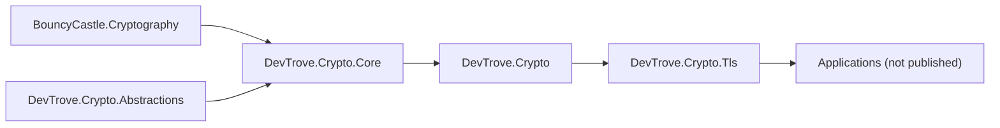

# Architecture

> 中文对照：[architecture.zh-CN.md](architecture.zh-CN.md)

This document describes the internal layering, dependency direction, capability boundaries and known limitations of `DevTrove.Crypto`.

---

## 1. Positioning

`DevTrove.Crypto` is an **independently published, framework-free, pure-managed** .NET cryptography library used by the DevTrove toolbox. It wraps BouncyCastle and provides:

| Capability | Examples |
|---|---|
| Algorithm primitives | RSA, ECDSA, DSA, AES (CBC / CFB / OFB / GCM) |
| Chinese national cryptography | SM2, SM3, SM4 (via BouncyCastle) |
| Key formats | PEM, DER, PKCS#1, PKCS#8, SEC1, encrypted PEM |
| ASN.1 / X.509 | parse and generate certificates, CSR, CRL, PKCS#12 |
| PKCS#7 / CMS | SignedData parsing — **planned, `0.5.0`** |
| OCSP | response parsing — **planned, `0.5.0`** (no request construction, no signature verification; signature verification is evaluated in `0.7.0`) |
| TLS probe engine | protocol / suite matrices, extension fingerprint, NTLS detection, grading — **planned, `0.6.0`–`0.7.0`** |

### Goals

| # | Goal |
|---|---|
| G1 | **Pure-managed, zero native dependencies.** One assembly that behaves the same everywhere, with no `runtimes/<rid>/native` payload. |
| G2 | **Cross-platform.** Server, desktop, embedded and WebAssembly hosts are all first-class; nothing in the library depends on a host OS policy. |
| G3 | **AOT- and trim-friendly** on `net8.0` and later, so consumers can ship trimmed or ahead-of-time compiled applications. |
| G4 | **Wide compatibility surface.** `netstandard2.0` keeps older runtimes — including .NET Framework and Unity — usable, while `net8.0`–`net10.0` carry the modern and AOT surface. Every shipped target has a host that actually resolves and runs it in CI. |
| G5 | **Framework-free.** No DI, no logging, no ASP.NET Core; the library never decides how a consumer wires it up. |
| G6 | **Independently published and versioned**, with a self-contained document set. |
| G7 | **Contracts separable from implementation.** The public contracts live in `DevTrove.Crypto.Abstractions`, a zero-dependency leaf assembly, so a consumer can compile against the interface surface alone. |

The library is published and versioned on its own; nothing in it depends on how or where it is consumed. See [roadmap.md](roadmap.md) for the version line and the current status of each goal.

---

## 2. Repository layout

```
DevTrove.Crypto/
├─ src/
│  ├─ DevTrove.Crypto.Abstractions/  contracts: interfaces and abstract base types (zero dependencies)
│  ├─ DevTrove.Crypto/               metapackage (no source — see §3)
│  ├─ DevTrove.Crypto.Core/          implementation
│  └─ DevTrove.Crypto.Tls/           TLS probe engine (planned — see [roadmap.md](roadmap.md) §6.19)
├─ tests/
│  ├─ DevTrove.Crypto.Core.Tests/
│  └─ DevTrove.Crypto.TestSupport/   tongsuo CLI helpers
├─ scripts/                     fixture generation scripts
└─ docs/                        development documentation (English default + .zh-CN.md)
```

Each `src/<Project>/` directory corresponds to one NuGet package.

---

## 3. Packages

| Package ID | Role | Notes |
|---|---|---|
| `DevTrove.Crypto.Abstractions` | **Contracts**: interfaces and abstract base types for the symmetric, asymmetric, hash and X.509 surfaces | **Planned, `0.1.0`.** The leaf of the dependency graph — it references no package at all, BouncyCastle included. |
| `DevTrove.Crypto.Core` | **Implementation**: BouncyCastle wrapper — algorithms, keys, ASN.1, X.509, CSR, PKCS#7/#12, CRL, OCSP parse | The library that actually ships code. Depends on `DevTrove.Crypto.Abstractions`. |
| `DevTrove.Crypto` | **Metapackage (facade)**: only `ProjectReference` → Core; no source code, no public API types | Consumers should reference this. Core — and through it Abstractions — is pulled in transitively. |
| `DevTrove.Crypto.Tls` | **TLS probe engine** | **Planned.** The namespace is reserved and the package is scheduled for `0.6.0`; no types exist today (see [roadmap.md](roadmap.md) §6.19). |

### Dependency graph



---

## 4. Source layout

Two assemblies carry source. Contracts live in one, implementations in the other, and nothing crosses back.

> **`DevTrove.Crypto.Core` currently holds no source.** The Web-era implementation was removed and is being rebuilt against the contracts below, so the tree that used to be printed here no longer describes anything real. It is deliberately not reproduced.

### 4.1 `DevTrove.Crypto.Abstractions` (lands in `0.1.0`)

A **flat** layout — no intermediate directory layer — so the namespace maps one-to-one onto the directory.

```
src/DevTrove.Crypto.Abstractions/
├─ Symmetric/    → DevTrove.Crypto.Abstractions.Symmetric
├─ Asymmetric/   → DevTrove.Crypto.Abstractions.Asymmetric
├─ Hash/         → DevTrove.Crypto.Abstractions.Hash
└─ X509/         → DevTrove.Crypto.Abstractions.X509
```

BCL adapters sit next to the family they adapt rather than in a separate `Interop/` directory.

| Directory | Contracts |
|---|---|
| `Symmetric/` | `CipherModeKind`, `PaddingKind`, `ISymmetricBlockCipher`, `SymmetricBlockCipher`, `SymmetricBlockCipherInteropExtensions` |
| `Asymmetric/` | `ISigner`, `IKeyEncipherment`, `IKeyAgreement`, `IAsymmetricKey`, `IPrivateKey`, `IPublicKey`, `AsymmetricKeyBase`, `SignatureAlgorithmKind` |
| `Hash/` | `IDigest`, `DigestBase`, `DigestInteropExtensions` |
| `X509/` | `ICertificate`, `ICertificateReader`, `ICertificateWriter`, `IDistinguishedName` |

### 4.2 `DevTrove.Crypto.Core` — target layout

Everything under the old `Crypto/` directory becomes `Algorithms/`, split by family; the SM proxies are renamed to `Sm2Crypto` / `Sm3Crypto` / `Sm4Crypto`; BouncyCastle types leave the public surface and move behind the `Interop/` extensions.

| Directory | Namespace | Lands in |
|---|---|---|
| `Asn1/` | `DevTrove.Crypto.Asn1` | `0.1.0` |
| `Interop/` | `DevTrove.Crypto.Interop` | `0.1.0` |
| `Compat/` | internal only | `0.1.0` |
| `X509/` | `DevTrove.Crypto.X509` | existing |
| `Algorithms/Symmetric/` | `DevTrove.Crypto.Algorithms.Symmetric` | `0.2.0` |
| `Algorithms/Asymmetric/` | `DevTrove.Crypto.Algorithms.Asymmetric` | `0.3.0` |
| `Algorithms/Hash/` | `DevTrove.Crypto.Algorithms.Hash` | `0.4.0` |
| `Formats/` | `DevTrove.Crypto.Formats` | `0.5.0` |
| `X509/Chain/` | `DevTrove.Crypto.X509.Chain` | `0.5.0` |
| `X509/Ocsp/` | `DevTrove.Crypto.X509.Ocsp` | `0.5.0` |

Each family's concrete algorithms land in the milestone named above, implemented against the `0.1.0` contracts. Per-item status is in [roadmap.md](roadmap.md) §6.

---

## 5. Dependency direction (single, enforced)

| From | To | Allowed? |
|---|---|---|
| `DevTrove.Crypto.Abstractions` | any package, `BouncyCastle.Cryptography` included | ❌ — it is the leaf |
| `DevTrove.Crypto.Core` | `DevTrove.Crypto.Abstractions` | ✅ |
| `DevTrove.Crypto.Core` | `BouncyCastle.Cryptography` | ✅ |
| `DevTrove.Crypto` (metapackage) | `DevTrove.Crypto.Core` | ✅ (only via `ProjectReference`) |
| `DevTrove.Crypto.Tls` | `DevTrove.Crypto.Core` | ✅ |
| Any project in this repository | any DI / logging / ASP.NET Core / `Microsoft.Extensions.*` | ❌ |

The library is **framework-free** — no DI, no logging, no ASP.NET Core. Combined with the goal set in §1 this keeps the consumer base as wide as possible (server, desktop, embedded, WebAssembly, trimmed / AOT builds) and keeps test packages the only decision surface for cross-cutting concerns.

---

## 6. Capability boundaries

### 6.1 What BouncyCastle can do for us

- **Protocol versions**: `ProtocolVersion.SSLv3` (`0x0300`) through TLS 1.3 (`0x0304`); `CLIENT_EARLIEST_SUPPORTED_TLS = SSLv3` — pure-managed enumeration of the full range, not subject to the host OS policy.
- **Callbacks on `TlsClient`**: `GetClientExtensions`, `GetSupportedVersions`, `GetCipherSuites`, `GetEarlyKeyShareGroups`, `NotifyServerVersion`, `NotifySelectedCipherSuite`, `ProcessServerExtensions(IDictionary<int, byte[]>)`, `NotifyNewSessionTicket`.
- **Key types**: `CertificateStatus` (OCSP staple), `CertificateStatusRequest`, `OcspStatusRequest`, `ExtensionType`, `TlsExtensionsUtilities`, `NamedGroup` (including `curveSM2MLKEM768`), `TlsServerCertificate`.
- **RFC 8998** (SM2-TLS 1.3) is built in: `TLS_SM4_GCM_SM3 = 0x00C6`, `TLS_SM4_CCM_SM3 = 0x00C7`, `tls13_hkdf_sm3`.
- `TlsProtocol` is abstract with `WriteRecord`, `SafeWriteRecord`, `WriteHandshakeMessage`, `ReadExtensionsData`/`WriteExtensionsData`, `OfferInput`/`ReadOutput` (non-blocking) — sub-classable to inject raw records.

### 6.2 What BouncyCastle **cannot** do

| Cannot do | Reason |
|---|---|
| Heartbleed probing | `TlsProtocol.ProcessRecord` heartbeat branch is commented out |
| CCS Injection | Same — requires custom record layer + key derivation |
| NTLS full handshake | (see §6.3) |

### 6.3 NTLS / GB/T 38636

NTLS has three structural differences from standard TLS:

| Difference | Value |
|---|---|
| Protocol version (`legacy_version`) | `0x0101` (not `0x0303`) |
| Cipher suites | `0xE011`, `0xE013`, `0xE051`, `0xE053`, … |
| Dual certificate | One signing cert + one encryption cert (SM2) |

BouncyCastle rejects these:

- `ProtocolVersion.IsSupportedTlsVersionClient` constrains `FullVersion ∈ [0x0300, 0x0304]` → `0x0101` is rejected; `legacy_version` is hard-coded in the protocol layer.
- `0xE0xx` suites are not recognized by the key-exchange factory or PRF selection.
- No GB/T 38636 ECC/ECDHE-SM2 key-exchange implementation.

**NTLS detection can still be done at zero cryptographic cost**: `ClientHello` / `ServerHello` / `Certificate` / `ServerKeyExchange` are all plaintext in TLS 1.2, so a handcrafted `ClientHello` (`legacy_version=0x0101`, suites `0xE011/0xE013/0xE051/0xE053`, SM2 signature algorithms, SNI) plus a hand-rolled parse yields version, suites, dual-certificate presence, signature algorithm, curve.

Full NTLS handshake (record layer + SM3 PRF + SM2 key-exchange + SM4 record protection + dual-cert handling) is **out of scope** for v1 — it requires implementing a TLS 1.2 subset from scratch, with concentrated risk on national-standard details (IV generation, padding, MAC ordering, PRF labels, signature encoding).

---

## 7. Known limitations and capability gaps

Two different things live here, and conflating them is what produced the previous round of documentation drift.

- **Gaps** — capability the library does **not** have yet. They carry a target version.
- **Limitations** — behaviour that is real, deliberate and will stay. They must be surfaced in any result object or UI that consumes them.

### 7.1 Capability gaps

| # | Gap | Impact | Target |
|---|---|---|---|
| G1 | No certificate-chain building or path verification at all — only single-step signature checks via `Certificate.IsSignatureVerify` | Callers cannot validate a chain today | `0.5.0` (`RM-0.5.0-01`) |
| G2 | No PKIX path validation (no `AuthorityKeyIdentifier`, `KeyUsage`, `BasicConstraints`, path length, policy or name constraints) | Chains PKIX would reject may be accepted | `1.0.0` (`RM-1.0.0-02`) |
| G3 | No OCSP code of any kind | No revocation-state verdict | `0.5.0` (`RM-0.5.0-08`); signature verification evaluated in `0.7.0` |
| G4 | No PKCS#7 / CMS support | Cannot consume CMS SignedData | `0.5.0` (`RM-0.5.0-07`) |
| G5 | No key-derivation functions (HKDF, PBKDF2, scrypt) | Callers must implement key derivation themselves — the most error-prone step to hand-roll | `0.4.0` (`RM-0.4.0-03`) |
| G6 | No HMAC of any kind | `0.4.0` (`RM-0.4.0-02`) |
| G7 | No Ed25519 / Ed448 / X25519 family | Modern signature and key-agreement suites unavailable | `0.3.0` (`RM-0.3.0-02`) |
| G8 | No format auto-detection (PEM / DER and friends) | Callers must know the format before calling | `0.5.0` (`RM-0.5.0-03`) |
| G9 | `netstandard2.0` does not build | The advertised compatibility surface does not exist | `RM-0.1.0-01` |
| G10 | No published contracts — the interface surface does not exist yet | Nothing can be compiled against a stable contract | `0.1.0` (`RM-0.1.0-01`–`-05`) |

### 7.2 Limitations that stay

| # | Limitation | Impact | Note |
|---|---|---|---|
| L1 | NTLS is **byte-level fingerprinting only**, no full handshake | The complete ShangMi stack cannot be exercised | Requires a TLS 1.2 subset built from scratch (see [tls-scanner.md §6.3](tls-scanner.md)) |
| L2 | No L3 vulnerability probing (Heartbleed, CCS Injection, Ticketbleed) | No vulnerability verdict for those classes | Explicit non-goal; only ROBOT is in scope |
| L3 | Asymmetric proxies expose only the capabilities their algorithm actually has | Not every asymmetric type can sign *and* encrypt | X25519 only agrees keys; Ed25519 only signs (see [roadmap.md](roadmap.md) §6.16) |

See [roadmap.md](roadmap.md) for the status of every gap.

---

## 8. Technical decisions

| # | Decision | Reason |
|---|---|---|
| D1 | BouncyCastle over .NET-native `SslStream` for TLS probing | `CipherSuitesPolicy` carries `[UnsupportedOSPlatform("windows")]`, doesn't expose raw handshake bytes / extensions / OCSP staple / SCT, and can only return the single negotiated result — can't build a matrix |
| D2 | BouncyCastle over a native stack (P/Invoke) | Pure-managed runs everywhere consistently — including WebAssembly and trimmed / AOT builds; no `runtimes/<rid>/native` packaging burden; simpler CI |
| D3 | No L3 vulnerability probing | Heartbleed / CCS Injection need custom record layer + key derivation; BouncyCastle heartbeat branch is commented out |
| D4 | No `testssl.sh` packaging | GPLv2 — only as an optional external cross-check tool |
| D5 | NTLS does byte-level fingerprinting only, no full handshake | Plaintext handshake messages make detection sufficient for primary conclusions; full handshake would require implementing a TLS 1.2 subset from scratch with concentrated GB/T 38636 detail risk |
| D6 | TLS probe engine co-located with the crypto library, package `DevTrove.Crypto.Tls` — no separate TLS repo | Only one dependency (`DevTrove.Crypto`); co-location shares TFM / polyfill / CI / fixtures; cross-repo version alignment cost is avoided. Each package still has its own version number |
| D7 | Standalone repository: developed, tested and released on its own, keeping the `src/` layering inside | `src/` maps 1:1 to NuGet packages and namespaces; nothing in the repository depends on how or where it is consumed |
| D8 | Library version starts at `0.0.1-dev`, iterates as `0.0.X-dev`, then `0.1.0` once capability is complete | Decoupled from application version (see [nuget.md](nuget.md) §3); `0.x` allows breaking changes |
| D9 | Library ships its own result models — dependencies point outwards only | The library can be published and consumed standalone |
| D10 | Zero framework dependencies: no DI / logging / ASP.NET Core | Widest consumer base (.NET Framework, Unity, WebAssembly, trimmed / AOT); keeps the test surface clean |
| D11 | Metapackage is source-free | Only `ProjectReference` → Core; consumers see only the metapackage; the implementation package can be swapped later without breaking the public contract |
| D12 | No native dependencies, no `runtimes/<rid>/native` | Single-binary deployment, no platform matrix, WebAssembly- and AOT-compatible |
| D13 | RSA encryption defaults to OAEP-SHA256, signature defaults to PSS; PKCS#1 v1.5 kept as option | Modern defaults; interoperability preserved |
| D14 | ECDSA / DSA signatures use DER standard encoding | Cross-tool interoperability (OpenSSL, etc.) |
| D15 | AES and SM4 both support ECB, but CBC is the default. ECB is documented as insecure in every XML comment and is intended only for interoperability or legacy protocols | ECB is not safe for new designs; supporting it is necessary for interop, so the library supports it and warns instead of blocking. GCM uses a 12-byte random nonce and a 16-byte tag |
| D16 | DSA supports only sign/verify (algorithm limitation); key lengths 1024/2048/3072 | DSA cannot encrypt by definition |
| D17 | ECDH returns raw shared-secret bytes; KDF is the caller's responsibility | Library doesn't impose KDF choice |
| D18 | Test fixtures are **generated, never committed**: `tests/data/` is ignored wholesale and rebuilt by `scripts/generate-test-*.sh`, which a test-assembly module initializer invokes on demand. Fixtures keep a short validity (≈1 year). Data no script can produce — captured NTLS handshake bytes — lives in `tests/fixtures/`, which **is** version-controlled | CI must not depend on remote generation, and assertions must not rely on "currently valid" **or on a fixture file being present in the repository** |
| D19 | Missing external tools fail tests (`CliToolGuard`) rather than skip | Surfaces environment issues immediately |
| D20 | **Cryptography abstractions are built in-house**, with BCL adapters only where `CryptoStream` / `SslStream` / `X509Certificate2` interop is needed | The BCL base classes cannot express CTR or AEAD (`CipherMode` is a closed enum), and `.NET 8`-only virtuals such as `TryEncryptEcbCore` do not exist on the `netstandard` targets — inheriting them ties the library's capability set to a target framework. See [roadmap.md](roadmap.md) §6.14 |
| D21 | BouncyCastle types stay out of the public API; interop goes through explicit `Interop` extensions | The implementation package is meant to be replaceable without breaking consumers; 9 public members used to leak BouncyCastle types |
| D22 | Tongsuo is the **single** external tool for fixtures and interop tests | One tool to install, pin and cache; it covers both standard algorithms and ShangMi. Upstream OpenSSL interoperability is no longer asserted — recorded as a risk in [roadmap.md](roadmap.md) §8 |
| D23 | Algorithm proxies are named `<Algorithm>Crypto` (`RsaCrypto`, `Sm2Crypto`, `Sm4Crypto`, …) | One naming rule for every algorithm; the previous mix of `RsaCrypto` and `SM2` was arbitrary |
| D24 | **The contracts live in their own assembly**, `DevTrove.Crypto.Abstractions`, which depends on nothing — not even BouncyCastle | A consumer can compile against the interface surface without taking the implementation or the BouncyCastle dependency; it also makes "BouncyCastle types must not appear in a public signature" (D21) mechanically enforceable rather than a review rule, because the abstraction assembly has no BouncyCastle reference to leak |
| D25 | Guards for `netstandard2.0` are chosen **per API**, not with one blanket symbol | The missing APIs differ: `Convert.FromHexString` is absent from every `netstandard` target, while `HashAlgorithm.HashCore(ReadOnlySpan<byte>)` exists on `netstandard2.1` but not on `netstandard2.0`. A single symbol would either over- or under-guard |

### Decisions explicitly rejected

| Option | Why rejected |
|---|---|
| Tongsuo P/Invoke for NTLS full handshake | Native dependency conflicts with pure-managed / WebAssembly goals |
| `testssl.sh` packaging | GPLv2 |
| Self-implemented record layer for Heartbleed / CCS Injection | Cost; BC heartbeat branch is commented out |

---

## 9. Status snapshot

See [roadmap.md](roadmap.md) for the version line, per-item status and evidence.

- **`DevTrove.Crypto.Abstractions`**: not started. Scheduled for `0.1.0`; carries the contracts only, with no implementation type.
- **`DevTrove.Crypto.Core`**: holds no source today. The Web-era RSA / ECDSA / DSA / AES / SM2 / SM3 / SM4 and X.509 / CSR / CRL / PKCS#12 code was removed and is being rebuilt against the contracts above. It does **not** build for `netstandard2.0` yet, and has no certificate-chain, OCSP, PKCS#7, KDF, MAC or Ed25519 / X25519 support — see §7.1.
- **`DevTrove.Crypto` (metapackage)**: the project exists and is source-free; it now inherits the shared TFM set instead of pinning one framework.
- **`DevTrove.Crypto.Tls`**: not started. Namespace reserved; scheduled for `0.6.0`.

Quantitative claims (test counts, build outcomes) are deliberately kept out of this document: they cannot be verified by reading it, and the previous revision proved how quickly such numbers rot. Take them from the build and test output, or from the evidence column in [roadmap.md](roadmap.md).

See [library-api.md](library-api.md) for the public API index.
