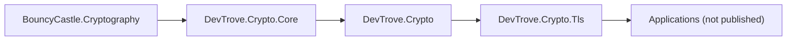

# Architecture

> 中文对照：[architecture.zh-CN.md](architecture.zh-CN.md)

This document describes the internal layering, dependency direction, capability boundaries and known limitations of `DevTrove.Crypto`.

---

## 1. Positioning

`DevTrove.Crypto` is an **independently published, framework-free, pure-managed** .NET cryptography library used by the DevTrove toolbox. It wraps BouncyCastle and provides:

| Capability | Examples |
|---|---|
| Algorithm primitives | RSA, ECDSA, DSA, AES (CBC / CFB / OFB / GCM) |
| Chinese national cryptography | SM2, SM3, SM4 (via BouncyCastle) |
| Key formats | PEM, DER, PKCS#1, PKCS#8, SEC1, encrypted PEM |
| ASN.1 / X.509 | parse and generate certificates, CSR, CRL, PKCS#7, PKCS#12 |
| OCSP | parse responses (no request construction, no signature verification — see §6) |

**Independence**: this repository is published and versioned on its own. It does not depend on the application repository (`DevTrove`) and does not reference any document path, section number or line number from it. Cross-repo references use plain prose only.

---

## 2. Repository layout

```
DevTrove.Crypto/
├─ src/
│  ├─ DevTrove.Crypto/         metapackage (no source — see §3)
│  ├─ DevTrove.Crypto.Core/    implementation
│  └─ DevTrove.Crypto.Tls/     TLS probe engine (reserved namespace; see §6)
├─ tests/
│  ├─ DevTrove.Crypto.Core.Tests/
│  └─ DevTrove.Crypto.TestSupport/   OpenSSL CLI helpers
├─ scripts/                     fixture generation scripts
└─ docs/                        development documentation (English default + .zh-CN.md)
```

Each `src/<Project>/` directory corresponds to one NuGet package.

---

## 3. Packages

| Package ID | Role | Notes |
|---|---|---|
| `DevTrove.Crypto` | **Metapackage (facade)**: only `ProjectReference` → Core; no source code, no public API types | Consumers should reference this. `DevTrove.Crypto.Core` is pulled in transitively. |
| `DevTrove.Crypto.Core` | **Implementation**: BouncyCastle wrapper — algorithms, keys, ASN.1, X.509, CSR, PKCS#7/#12, CRL, OCSP parse | The library that actually ships code. |
| `DevTrove.Crypto.Tls` | **TLS probe engine** | Reserved. Namespace reserved; the engine is scheduled for a future phase (see [roadmap.md](roadmap.md)). |

> **Known deviation** (see [roadmap.md](roadmap.md) §7 「Pending / Known deviations」, item B2): the metapackage project at `src/DevTrove.Crypto/` still contains a leftover `Program.cs`. The project produces a `net10.0` assembly regardless of the global `<TargetFrameworks>`, which together with Core's 3-TFM set causes `dotnet build DevTrove.Crypto.slnx -c Release` to fail with `NU1201`. The metapackage-as-source-free-project is a planned target; cleanup is tracked in the roadmap.

### Dependency graph



---

## 4. Source layout (Core)

```
src/DevTrove.Crypto.Core/
├─ Crypto/
│  ├─ AsymmetricKeyPair.cs              RSA / EC / DSA / SM2 key-pair generation
│  ├─ AsymmetricKeyParameter.cs         PEM/DER import-export base
│  ├─ AsymmetricPrivateKeyParameter.cs
│  ├─ AsymmetricPublicKeyParameter.cs
│  ├─ RsaCrypto.cs                      RSA encryption/signature
│  ├─ EcdsaCrypto.cs                    ECDSA sign/verify + ECDH
│  ├─ DsaCrypto.cs                      DSA sign/verify
│  ├─ AesCrypto.cs                      AES-CBC / CFB / OFB / GCM (ECB disabled)
│  └─ Sm/
│     ├─ SM2.cs                         Sign/verify, encrypt/decrypt, key exchange
│     ├─ SM3.cs                         Hash
│     └─ SM4.cs                         Block cipher (CBC / CTR / GCM)
├─ X509/
│  ├─ Certificate.cs                    Parse + generate (self-signed / sign-csr / sign-public-key)
│  ├─ CertificateSigningRequest.cs      Generate (with extensions) + parse + verify
│  ├─ CertificateRevocationList.cs      Generate + parse + IsRevoked
│  ├─ Enums/                            KeyUsage / ExtendedKeyUsage / GeneralNameType / CertificatePolicy / CertificateRevocationReason + helpers
│  ├─ Extensions/                       X509ExtensionBuilder + helpers
│  ├─ Models/                           X509DistinguishedName / GeneralName / PfxBundle / X509ExtensionOptions / CertificateExtension / RevokedCertificate
│  └─ Utils/                            CertificateUtils / PfxUtils / X509NameParser
├─ BouncyCastle/
│  ├─ Asn1/X509/                        ASN.1/X.509 extension methods
│  └─ ObjectIdentifiers/                OID constants
├─ Common/                              EnumDisplayNameCache
├─ Extensions/                          ArgumentNullExceptionExtensions
└─ Resources/                           zh-hans + en-us resx
```

> **Known deviation** (roadmap item B3): `netstandard2.0` polyfill in `Compat/` is **planned but the directory does not exist yet**. Core currently targets `net8.0;net9.0;net10.0` (3 TFM). The 5-TFM target (`netstandard2.0;netstandard2.1;net8.0;net9.0;net10.0`) is a roadmap item.

---

## 5. Dependency direction (single, enforced)

| From | To | Allowed? |
|---|---|---|
| `DevTrove.Crypto.Core` | `BouncyCastle.Cryptography` | ✅ |
| `DevTrove.Crypto` (metapackage) | `DevTrove.Crypto.Core` | ✅ (only via `ProjectReference`) |
| `DevTrove.Crypto.Tls` | `DevTrove.Crypto.Core` | ✅ |
| `DevTrove.Crypto.Tls` | `DevTrove.Core` / any DI / ASP.NET Core / `Microsoft.Extensions.*` | ❌ |
| `DevTrove.Crypto` family | any DI / logging / ASP.NET Core / `Microsoft.Extensions.*` | ❌ |

The library is **framework-free** — no DI, no logging, no ASP.NET Core. This keeps it compatible with the broadest set of consumers (server, desktop, WebAssembly) and keeps test packages the only decision surface for cross-cutting concerns.

---

## 6. Capability boundaries

### 6.1 What BouncyCastle can do for us

- **Protocol versions**: `ProtocolVersion.SSLv3` (`0x0300`) through TLS 1.3 (`0x0304`); `CLIENT_EARLIEST_SUPPORTED_TLS = SSLv3` — pure-managed enumeration of the full range, not subject to the host OS policy.
- **Callbacks on `TlsClient`**: `GetClientExtensions`, `GetSupportedVersions`, `GetCipherSuites`, `GetEarlyKeyShareGroups`, `NotifyServerVersion`, `NotifySelectedCipherSuite`, `ProcessServerExtensions(IDictionary<int, byte[]>)`, `NotifyNewSessionTicket`.
- **Key types**: `CertificateStatus` (OCSP staple), `CertificateStatusRequest`, `OcspStatusRequest`, `ExtensionType`, `TlsExtensionsUtilities`, `NamedGroup` (including `curveSM2MLKEM768`), `TlsServerCertificate`.
- **RFC 8998** (SM2-TLS 1.3) is built in: `TLS_SM4_GCM_SM3 = 0x00C6`, `TLS_SM4_CCM_SM3 = 0x00C7`, `tls13_hkdf_sm3`.
- `TlsProtocol` is abstract with `WriteRecord`, `SafeWriteRecord`, `WriteHandshakeMessage`, `ReadExtensionsData`/`WriteExtensionsData`, `OfferInput`/`ReadOutput` (non-blocking) — sub-classable to inject raw records.

### 6.2 What BouncyCastle **cannot** do

| Cannot do | Reason |
|---|---|
| Heartbleed probing | `TlsProtocol.ProcessRecord` heartbeat branch is commented out |
| CCS Injection | Same — requires custom record layer + key derivation |
| NTLS full handshake | (see §6.3) |

### 6.3 NTLS / GB/T 38636

NTLS has three structural differences from standard TLS:

| Difference | Value |
|---|---|
| Protocol version (`legacy_version`) | `0x0101` (not `0x0303`) |
| Cipher suites | `0xE011`, `0xE013`, `0xE051`, `0xE053`, … |
| Dual certificate | One signing cert + one encryption cert (SM2) |

BouncyCastle rejects these:

- `ProtocolVersion.IsSupportedTlsVersionClient` constrains `FullVersion ∈ [0x0300, 0x0304]` → `0x0101` is rejected; `legacy_version` is hard-coded in the protocol layer.
- `0xE0xx` suites are not recognized by the key-exchange factory or PRF selection.
- No GB/T 38636 ECC/ECDHE-SM2 key-exchange implementation.

**NTLS detection can still be done at zero cryptographic cost**: `ClientHello` / `ServerHello` / `Certificate` / `ServerKeyExchange` are all plaintext in TLS 1.2, so a handcrafted `ClientHello` (`legacy_version=0x0101`, suites `0xE011/0xE013/0xE051/0xE053`, SM2 signature algorithms, SNI) plus a hand-rolled parse yields version, suites, dual-certificate presence, signature algorithm, curve.

Full NTLS handshake (record layer + SM3 PRF + SM2 key-exchange + SM4 record protection + dual-cert handling) is **out of scope** for v1 — it requires implementing a TLS 1.2 subset from scratch, with concentrated risk on national-standard details (IV generation, padding, MAC ordering, PRF labels, signature encoding).

---

## 7. Known limitations

These are **real and intentional**. They must be exposed in any consumer UI or result object (see the consuming repository's `docs/testing.md` for the application-side treatment).

| # | Limitation | Impact | Plan |
|---|---|---|---|
| L1 | Certificate-chain verification is a **simplified implementation** (DN comparison + per-step signature + trust-root check) — **not full PKIX**: no `AuthorityKeyIdentifier`, `KeyUsage`, `BasicConstraints`, path length, policy / name constraints | Chains PKIX would reject may be accepted | v1.1: upgrade to PKIX |
| L2 | Certificate-chain **building** does not terminate on mutually-signed inputs (infinite append) | Pathological input can exhaust memory | v1.1: cycle + depth protection |
| L3 | OCSP **parse only**: no request construction, no response signature verification | Cannot judge response trustworthiness or target-cert match | v2: evaluate |
| L4 | NTLS is **byte-level fingerprinting only**, no full handshake | Cannot validate full stack behavior | v2: evaluate |
| L5 | No L3 vulnerability probing (Heartbleed / CCS Injection / Ticketbleed — see §6.2) | No vulnerability verdict | Explicit non-goal |

---

## 8. Technical decisions

| # | Decision | Reason |
|---|---|---|
| D1 | BouncyCastle over .NET-native `SslStream` for TLS probing | `CipherSuitesPolicy` carries `[UnsupportedOSPlatform("windows")]`, doesn't expose raw handshake bytes / extensions / OCSP staple / SCT, and can only return the single negotiated result — can't build a matrix |
| D2 | BouncyCastle over Tongsuo (native P/Invoke) | Pure-managed runs everywhere consistently, including WebAssembly; no `runtimes/<rid>/native` packaging burden; simpler CI |
| D3 | No L3 vulnerability probing | Heartbleed / CCS Injection need custom record layer + key derivation; BouncyCastle heartbeat branch is commented out |
| D4 | No `testssl.sh` packaging | GPLv2 — only as an optional external cross-check tool |
| D5 | NTLS does byte-level fingerprinting only, no full handshake | Plaintext handshake messages make detection sufficient for primary conclusions; full handshake would require implementing a TLS 1.2 subset from scratch with concentrated GB/T 38636 detail risk |
| D6 | TLS probe engine co-located with the crypto library, package `DevTrove.Crypto.Tls` — no separate TLS repo | Only one dependency (`DevTrove.Crypto`); co-location shares TFM / polyfill / CI / fixtures; cross-repo version alignment cost is avoided. Each package still has its own version number |
| D7 | Submodule mounted at `lib/Crypto` with the `dev` branch tracked, preserving `src/` layering inside | One submodule path to remember; `src/` layering maps 1:1 to NuGet packages and namespaces |
| D8 | Library version starts at `0.0.1-dev`, iterates as `0.0.X-dev`, then `0.1.0` once capability is complete | Decoupled from application version (see [nuget.md](nuget.md) §3); `0.x` allows breaking changes |
| D9 | Library produces its own result models — no dependency on the application `DevTrove.Core` | The library can be published and consumed standalone |
| D10 | Zero framework dependencies: no DI / logging / ASP.NET Core | Broadest consumer base (.NET Framework, Unity, WebAssembly); keeps the test surface clean |
| D11 | Metapackage is source-free | Only `ProjectReference` → Core; consumers see only the metapackage; the implementation package can be swapped later without breaking the public contract |
| D12 | No native dependencies, no `runtimes/<rid>/native` | Single-binary deployment, no platform matrix, WebAssembly-compatible |
| D13 | RSA encryption defaults to OAEP-SHA256, signature defaults to PSS; PKCS#1 v1.5 kept as option | Modern defaults; interoperability preserved |
| D14 | ECDSA / DSA signatures use DER standard encoding | Cross-tool interoperability (OpenSSL, etc.) |
| D15 | AES ECB disabled; GCM uses 12-byte random nonce + 16-byte auth tag | ECB vulnerability; GCM nonce uniqueness requirement |
| D16 | DSA supports only sign/verify (algorithm limitation); key lengths 1024/2048/3072 | DSA cannot encrypt by definition |
| D17 | ECDH returns raw shared-secret bytes; KDF is the caller's responsibility | Library doesn't impose KDF choice |
| D18 | Test fixtures are committed in-repo with short validity (≈1 year) and rotated regularly | CI must not depend on remote generation; assertions cannot rely on "currently valid" |
| D19 | Missing external tools fail tests (`CliToolGuard`) rather than skip | Surfaces environment issues immediately |

### Decisions explicitly rejected

| Option | Why rejected |
|---|---|
| Tongsuo P/Invoke for NTLS full handshake | Native dependency conflicts with pure-managed / WebAssembly goals |
| `testssl.sh` packaging | GPLv2 |
| Self-implemented record layer for Heartbleed / CCS Injection | Cost; BC heartbeat branch is commented out |

---

## 9. Status snapshot (see [roadmap.md](roadmap.md) for full state)

- **`DevTrove.Crypto.Core`**: implemented — RSA / ECDSA / DSA / AES / SM2 / SM3 / SM4, X.509 / CSR / CRL / PFX (parse + generate). Test base covers 293 cases (net8.0 / net10.0) including OpenSSL interop and three-way cross-validation; SM2 fixtures generated by tongsuo.
- **`DevTrove.Crypto` (metapackage)**: project exists; **known deviations** — leftover `Program.cs` and `net10.0`-only TFM (see roadmap §7 B1, B2).
- **`DevTrove.Crypto.Tls`**: not yet started. Namespace reserved.

See [library-api.md](library-api.md) for the public API index.
