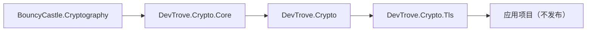

# 架构

> 英文默认入口：[architecture.md](architecture.md)

本文档描述 `DevTrove.Crypto` 的库内分层、依赖方向、能力边界、已知限制与技术决策。

---

## 1. 仓库定位

`DevTrove.Crypto` 是 DevTrove 工具箱的**核心库**，**独立发布、独立版本号**：
基于 BouncyCastle 的纯托管 .NET 密码学与证书库，提供：

| 能力 | 示例 |
|---|---|
| 算法原语 | RSA、ECDSA、DSA、AES（CBC / CFB / OFB / GCM） |
| 国密 | SM2、SM3、SM4（经 BouncyCastle） |
| 密钥格式 | PEM、DER、PKCS#1、PKCS#8、SEC1、加密 PEM |
| ASN.1 / X.509 | 证书 / CSR / CRL / PKCS#7 / PKCS#12 的解析与生成 |
| OCSP | 仅解析响应（不构造请求、不验签，见 §6） |

**独立性**：本仓库独立发布、独立版本。**不依赖**应用仓 `DevTrove`，亦不引用其文档路径、章节号或行号。跨仓引用只用纯文字。

---

## 2. 仓内布局

```
DevTrove.Crypto/
├─ src/
│  ├─ DevTrove.Crypto/         门面包（元包，无源码，见 §3）
│  ├─ DevTrove.Crypto.Core/    实现
│  └─ DevTrove.Crypto.Tls/     TLS 探测引擎（命名空间预留，见 §6）
├─ tests/
│  ├─ DevTrove.Crypto.Core.Tests/
│  └─ DevTrove.Crypto.TestSupport/   OpenSSL CLI 封装
├─ scripts/                     夹具生成脚本
└─ docs/                        开发文档（英文默认 + `.zh-CN.md` 中文）
```

每个 `src/<Project>/` 对应一个 NuGet 包。

---

## 3. 包清单

| 包 ID | 角色 | 说明 |
|---|---|---|
| `DevTrove.Crypto` | **门面包（元包）**：仅 `ProjectReference` → Core；无源码、无公开 API 类型 | 使用方引用此包；`DevTrove.Crypto.Core` 自动引入 |
| `DevTrove.Crypto.Core` | **实现**：BouncyCastle 封装 —— 算法、密钥、ASN.1、X.509、CSR、PKCS#7/#12、CRL、OCSP 解析 | 真正承载代码的包 |
| `DevTrove.Crypto.Tls` | **TLS 探测引擎** | 预留。命名空间已留；引擎在后续阶段实现（见 [roadmap.md](roadmap.md)） |

> **已知偏差**（见 [roadmap.md](roadmap.md) §7「待办 / 已知偏差」B2）：门面包项目 `src/DevTrove.Crypto/` 仍残留 `Program.cs`；项目固定 `net10.0` 单 TFM，与 Core 的 3 TFM 共同导致 `dotnet build DevTrove.Crypto.slnx -c Release` 报 **NU1201**。门面包无源码是目标态，清理进度跟踪在 roadmap。

### 依赖图



---

## 4. Core 源码布局

```
src/DevTrove.Crypto.Core/
├─ Crypto/
│  ├─ AsymmetricKeyPair.cs              RSA / EC / DSA / SM2 密钥对生成
│  ├─ AsymmetricKeyParameter.cs         PEM/DER 导入导出基类
│  ├─ AsymmetricPrivateKeyParameter.cs
│  ├─ AsymmetricPublicKeyParameter.cs
│  ├─ RsaCrypto.cs                      RSA 加解密 / 签名验签
│  ├─ EcdsaCrypto.cs                    ECDSA 签名验签 + ECDH
│  ├─ DsaCrypto.cs                      DSA 签名验签
│  ├─ AesCrypto.cs                      AES-CBC / CFB / OFB / GCM（禁用 ECB）
│  └─ Sm/
│     ├─ SM2.cs                         签名验签 / 加解密 / 密钥交换
│     ├─ SM3.cs                         摘要
│     └─ SM4.cs                         分组密码（CBC / CTR / GCM）
├─ X509/
│  ├─ Certificate.cs                    解析 + 生成（自签 / 签 CSR / 签公钥）
│  ├─ CertificateSigningRequest.cs      生成（含扩展）+ 解析 + 验签
│  ├─ CertificateRevocationList.cs      生成 + 解析 + IsRevoked
│  ├─ Enums/                            KeyUsage / ExtendedKeyUsage / GeneralNameType / CertificatePolicy / CertificateRevocationReason + Helpers
│  ├─ Extensions/                       X509ExtensionBuilder + Helpers
│  ├─ Models/                           X509DistinguishedName / GeneralName / PfxBundle / X509ExtensionOptions / CertificateExtension / RevokedCertificate
│  └─ Utils/                            CertificateUtils / PfxUtils / X509NameParser
├─ BouncyCastle/
│  ├─ Asn1/X509/                        ASN.1 / X.509 扩展方法
│  └─ ObjectIdentifiers/                OID 常量
├─ Common/                              EnumDisplayNameCache
├─ Extensions/                          ArgumentNullExceptionExtensions
└─ Resources/                           zh-hans + en-us resx
```

> **已知偏差**（roadmap B3）：`netstandard2.0` 的 polyfill 在 `Compat/` 目录**目前不存在**（计划中）。Core 实际为 3 TFM（`net8.0;net9.0;net10.0`）。5 TFM（`netstandard2.0;netstandard2.1;net8.0;net9.0;net10.0`）是 roadmap 待办。

---

## 5. 依赖方向（单向，强制）

| 来源 | 目标 | 是否允许 |
|---|---|---|
| `DevTrove.Crypto.Core` | `BouncyCastle.Cryptography` | ✅ |
| `DevTrove.Crypto`（门面包） | `DevTrove.Crypto.Core` | ✅（仅 `ProjectReference`） |
| `DevTrove.Crypto.Tls` | `DevTrove.Crypto.Core` | ✅ |
| `DevTrove.Crypto.Tls` | `DevTrove.Core` / 任何 DI / ASP.NET Core / `Microsoft.Extensions.*` | ❌ |
| `DevTrove.Crypto` 全家 | 任何 DI / 日志 / ASP.NET Core / `Microsoft.Extensions.*` | ❌ |

库**零框架依赖**：不引用 DI、日志、ASP.NET Core —— 最大化消费方覆盖（服务端、桌面、WebAssembly），把横切关注点的决定权留给消费方。

---

## 6. 能力边界

### 6.1 BouncyCastle 能做的

- **协议版本覆盖**：`ProtocolVersion.SSLv3`（`0x0300`）~ TLS 1.3（`0x0304`）；`CLIENT_EARLIEST_SUPPORTED_TLS = SSLv3` → 纯托管可枚举全范围，不受宿主 OS 策略影响
- **`TlsClient` 回调**：`GetClientExtensions`、`GetSupportedVersions`、`GetCipherSuites`、`GetEarlyKeyShareGroups`、`NotifyServerVersion`、`NotifySelectedCipherSuite`、`ProcessServerExtensions(IDictionary<int, byte[]>)`、`NotifyNewSessionTicket`
- **关键类型**：`CertificateStatus`（OCSP staple）、`CertificateStatusRequest`、`OcspStatusRequest`、`ExtensionType`、`TlsExtensionsUtilities`、`NamedGroup`（含 `curveSM2MLKEM768`）、`TlsServerCertificate`
- **RFC 8998**（SM2-TLS 1.3）已内建：`TLS_SM4_GCM_SM3 = 0x00C6`、`TLS_SM4_CCM_SM3 = 0x00C7`、`tls13_hkdf_sm3`
- `TlsProtocol` 为 abstract；`WriteRecord`、`SafeWriteRecord`、`WriteHandshakeMessage`、`ReadExtensionsData`/`WriteExtensionsData`、`OfferInput`/`ReadOutput`（非阻塞）可见 → 可子类化注入裸 record

### 6.2 BouncyCastle **做不到**的

| 做不到 | 原因 |
|---|---|
| Heartbleed 探测 | `TlsProtocol.ProcessRecord` 的 heartbeat 分支已被注释 |
| CCS Injection | 同上 —— 需要自研 record layer 与密钥派生 |
| NTLS 完整握手 | 见 §6.3 |

### 6.3 NTLS / GB/T 38636

NTLS 与标准 TLS 有三处**结构性差异**：

| 差异 | 值 |
|---|---|
| 协议版本（`legacy_version`） | `0x0101`（非 `0x0303`） |
| 套件 | `0xE011`、`0xE013`、`0xE051`、`0xE053` 等 |
| 双证书 | 一张签名证书 + 一张加密证书（均为 SM2） |

BouncyCastle 直接拒绝：

- `ProtocolVersion.IsSupportedTlsVersionClient` 约束 `FullVersion ∈ [0x0300, 0x0304]` → `0x0101` 被拒；`legacy_version` 由协议层写死
- `0xE0xx` 套件不被密钥交换工厂与 PRF 选择逻辑识别
- 无 GB/T 38636 ECC/ECDHE-SM2 密钥交换实现

**NTLS 检测可零密码学成本完成**：TLS 1.2 中 `ClientHello` / `ServerHello` / `Certificate` / `ServerKeyExchange` 均为明文，因此手工构造 `ClientHello`（`legacy_version=0x0101`、套件 `0xE011/0xE013/0xE051/0xE053`、SM2 签名算法、SNI）+ 手工解析即可得出版本、套件、双证书是否齐全、签名算法与曲线。

NTLS 完整握手（record layer + SM3 PRF + SM2 密钥交换 + SM4 记录保护 + 双证书处理）**不在 v1 范围** —— 需要自研 TLS 1.2 子集，国标细节（IV、padding、MAC 顺序、PRF 标签、签名编码）风险集中。

---

## 7. 已知限制

这些限制**已确认存在、当前版本有意不解决**，必须在消费方 UI 或结果对象中显式暴露。

| # | 限制 | 影响 | 计划 |
|---|---|---|---|
| L1 | 证书链验证为**精简实现**（DN 比对 + 逐级验签 + 信任根比对），**非 PKIX 完整路径校验**：未校验 `AuthorityKeyIdentifier`、`KeyUsage`、`BasicConstraints`、路径长度、策略与名称约束 | 可能把 PKIX 下本应被拒的链判为有效 | v1.1 升级 PKIX |
| L2 | 证书链**构建**对互相签发的输入不终止（无限追加） | 畸形输入可导致内存耗尽 | v1.1 与 PKIX 升级一并加环路与深度保护 |
| L3 | OCSP **仅解析响应**：不构造请求、不验证响应签名 | 无法判断响应是否可信、是否与目标证书匹配 | v2 评估 |
| L4 | NTLS 仅做**字节级指纹检测**，不做完整握手 | 无法握手验证国密栈完整行为 | v2 评估 |
| L5 | 不做 L3 漏洞探测（Heartbleed / CCS Injection / Ticketbleed，见 §6.2） | 不给出漏洞等级结论 | 明确不做 |

---

## 8. 技术决策

| # | 决策 | 理由 |
|---|---|---|
| D1 | 用 BouncyCastle 而非 .NET 原生 `SslStream` 做 TLS 探测 | `SslStream` 的 `CipherSuitesPolicy` 标 `[UnsupportedOSPlatform("windows")]`，不暴露裸握手字节 / 扩展 / OCSP staple / SCT，只能给出单次协商结果 —— 无法构造矩阵 |
| D2 | 用 BouncyCastle 而非铜锁（原生 P/Invoke） | 纯托管跨平台一致、可编译进 WebAssembly；无 `runtimes/<rid>/native` 打包负担；CI 更简单 |
| D3 | 不做 L3 漏洞探测 | Heartbleed / CCS Injection 需自研 record layer + 密钥派生；BouncyCastle heartbeat 分支被注释，无法复用 |
| D4 | 不打包 `testssl.sh` | 其许可证为 GPLv2；仅作可选外部交叉验证工具 |
| D5 | NTLS 只做字节级指纹检测，不做完整握手 | 握手报文明文足以得出主要结论；完整握手需自研 TLS 1.2 子集，国标细节风险集中 |
| D6 | TLS 探测引擎与 Crypto 同仓，包名 `DevTrove.Crypto.Tls`，不再另建独立 TLS 仓库 | 引擎只有一条依赖（`DevTrove.Crypto`）；同仓可共用 TFM / polyfill / CI / 夹具，省去跨仓版本对齐成本。三个包仍各自独立版本号 |
| D7 | 子仓以**单一子模块** `lib/Crypto` 挂载，跟踪 `dev` 分支，仓内保留 `src/` 分层 | 主仓只需记一个子模块路径；`src/` 分层与 NuGet 包、命名空间一一对应，避免仓根堆叠项目目录 |
| D8 | 核心库版本从 `0.0.1-dev` 起步，按 `0.0.X-dev` 迭代，能力齐备后发 `0.1.0` | 与应用版本解耦（见 [nuget.md](nuget.md) §3）；`0.x` 阶段允许破坏性变更 |
| D9 | 核心库自带结果模型，不依赖应用层 `DevTrove.Core` | 库可独立发布、独立使用 |
| D10 | 零框架依赖：不引用 DI / 日志 / ASP.NET Core | 最大化消费方覆盖（含 .NET Framework、Unity、WebAssembly）；测试面更干净 |
| D11 | 门面包无源码 | 仅 `ProjectReference` → Core；消费方只见门面包；将来可换实现而不破坏契约 |
| D12 | 不引入原生依赖，不打包 `runtimes/<rid>/native` | 单二进制部署、无平台矩阵、可编译进 WebAssembly |
| D13 | RSA 加密默认 OAEP-SHA256，签名默认 PSS；PKCS#1 v1.5 保留为可选 | 现代默认 + 兼容互操作 |
| D14 | ECDSA / DSA 签名使用标准 DER 编码 | 与 OpenSSL 等工具互操作 |
| D15 | AES 禁用 ECB；GCM 用 12 字节随机 Nonce + 16 字节认证标签 | ECB 已知漏洞；GCM Nonce 唯一性要求 |
| D16 | DSA 仅签名/验签（算法限制）；密钥长度 1024/2048/3072 | DSA 不能加密 |
| D17 | ECDH 返回原始共享密钥字节，KDF 由调用方决定 | 库不强加 KDF 选择 |
| D18 | 测试夹具入库（含私钥/PFX，统一口令 `test1234`），短有效期（≈1 年），定期重新生成 | CI 不依赖远程生成；断言字段不得依赖「当前有效」 |
| D19 | 外部工具缺失时测试**失败**而非跳过（`CliToolGuard`） | 环境问题立刻暴露 |

### 已否决的方案

| 方案 | 否决原因 |
|---|---|
| 铜锁 P/Invoke 做 NTLS 完整握手 | 原生依赖与 WebAssembly 目标冲突 |
| 打包 `testssl.sh` | GPLv2 |
| 自研 record layer 做 Heartbleed / CCS Injection | 成本；BC heartbeat 分支已被注释 |

---

## 9. 当前状态速览

完整路线见 [roadmap.md](roadmap.md)。

- **`DevTrove.Crypto.Core`**：已实现 —— RSA / ECDSA / DSA / AES / SM2 / SM3 / SM4，X.509 / CSR / CRL / PFX 的解析与生成。测试基 293 例（net8.0 / net10.0），含 OpenSSL 互操作与三类对照测试；SM2 夹具由 tongsuo 生成
- **`DevTrove.Crypto`（门面包）**：项目存在；**已知偏差** —— 残留 `Program.cs` 与 `net10.0` 单 TFM（见 roadmap §7 B1、B2）
- **`DevTrove.Crypto.Tls`**：未启动。命名空间已留

公开 API 索引见 [library-api.md](library-api.md)。
