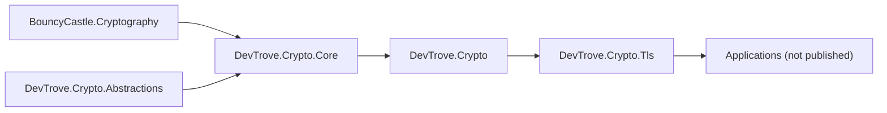

# NuGet packaging

> 中文对照：[nuget.zh-CN.md](nuget.zh-CN.md)

This document describes the package boundaries, versioning strategy and release process for `DevTrove.Crypto`.

---

## 1. Package list

| Package ID | Source repository | Role | Target frameworks |
|---|---|---|---|
| `DevTrove.Crypto.Abstractions` | this repo | **Contracts**: interfaces and abstract base types; zero package dependencies | `netstandard2.0;net8.0;net9.0;net10.0` |
| `DevTrove.Crypto.Core` | this repo | **Implementation**: BouncyCastle wrapper — algorithms, keys, ASN.1, X.509, CSR, PKCS#7/#12, CRL, OCSP parse | same as above |
| `DevTrove.Crypto` | this repo | **Metapackage (facade)**: stable public API | same as above |
| `DevTrove.Crypto.Tls` | this repo | TLS probe engine: protocol / cipher-suite matrices, extension parsing, grading, raw-byte probing | same as above |

**Note**: applications that consume this library are **not** published — they are `IsPackable=false`. This document covers only the packages produced by this repository.

> `netstandard2.1` is deliberately **not** a target. It was dropped during the `0.1.0` work because no non-EOL host resolves that asset, so it could never be covered by a runtime test. Every target that remains has a host that actually runs it in CI. See [roadmap.md](roadmap.md) §6.11.

---

## 2. Package boundary principles

| # | Principle |
|---|---|
| 1 | **Data-format layer separate from network-protocol layer**: `DevTrove.Crypto` handles data only; never does network access |
| 2 | **`DevTrove.Crypto.Tls` depends on `DevTrove.Crypto`**, no duplicate ASN.1 / X.509 / PKCS parsing |
| 3 | **No application dependency**: `DevTrove.Crypto.Tls` ships its own result models and depends only on `DevTrove.Crypto` |
| 4 | **Zero framework dependencies**: no DI, logging, ASP.NET Core; logging is the caller's responsibility |
| 5 | **Metapackage / implementation split**: consumers reference `DevTrove.Crypto`; `DevTrove.Crypto.Core` is pulled in transitively and may be swapped without breaking the public contract |
| 6 | **Contracts separate from implementation**: interfaces and abstract base types live in `DevTrove.Crypto.Abstractions`, which references no package at all. A consumer can compile against the contract surface alone; it also makes "no BouncyCastle type in a public signature" mechanically checkable |
| 7 | **Pure-managed**: no native dependencies, no `runtimes/<rid>/native` packaging |

### Dependency graph



---

## 3. Versioning

### 3.1 One version per milestone

The four packages **share a single version number per milestone**. There is no separate version per package: a milestone either ships all of them or ships only those that already exist (`DevTrove.Crypto.Abstractions` and `DevTrove.Crypto.Tls` appear for the first time in `0.1.0` and `0.6.0` respectively).

| Scenario | Version action |
|---|---|
| New API (backward compatible) | Minor bump |
| Bug fix | Patch bump |
| Breaking change | Major bump (before `1.0.0`, breaking changes are allowed in Minor, but must be highlighted in CHANGELOG) |
| Doc / comment only | No bump (or noted in Patch) |

Version numbers are independent of any consumer's version. See [roadmap.md §3](roadmap.md) for the milestone list.

### 3.2 Dependency version declaration

`DevTrove.Crypto.Core` declares a **minimum compatible version** of `DevTrove.Crypto.Abstractions`, and `DevTrove.Crypto.Tls` declares one of `DevTrove.Crypto`:

```xml
<PackageReference Include="DevTrove.Crypto.Abstractions" Version="[0.1.0, )" />
<PackageReference Include="DevTrove.Crypto" Version="[0.1.0, )" />
```

- Use a **lower-bound constraint** (`[x.y.z, )`) to permit consumers to upgrade to compatible newer versions.
- If a version introduces an incompatible change, bump the lower bound and the own Major simultaneously.

### 3.3 Pre-release versions

Early versions use `-dev` / `-preview` suffixes (e.g. `0.1.0-dev`) to avoid being referenced in production.

### 3.4 Where the version line starts

`0.0.1`–`0.0.13` are **work-item numbers only**: they are never packaged, tagged or published. The first real release is `0.1.0`. Breaking changes are allowed throughout `0.x` but must be flagged in CHANGELOG. See [roadmap.md §3](roadmap.md).

---

## 4. Required package metadata

Each publishable package **must** declare the following in `Directory.Build.props`:

| Property | Requirement |
|---|---|
| `PackageId` | `DevTrove.*` naming |
| `Version` | Explicit; no implicit default |
| `Authors` / `Company` | Required |
| `Description` | Required; what the package does |
| `PackageTags` | Search-friendly (e.g. `tls`, `x509`, `crypto`, `sm2`, `sm3`, `sm4`, `gm`, `certificate`) |
| `PackageLicenseExpression` | `Apache-2.0` — **must match the repo `LICENSE` file** |
| `RepositoryUrl` / `RepositoryType` | `git` |
| `PackageProjectUrl` | Project home page |
| `PackageReadmeFile` | Points to the README shipped with the package |
| `GenerateDocumentationFile` | `true` — **otherwise the package has no XML docs and consumers get no IntelliSense** |
| `IncludeSymbols` + `SymbolPackageFormat` | `true` + `snupkg` for debugging |
| `IsPackable` | `true` |

**Recommendation**: enable SourceLink so consumers can jump straight to the source.

> `<Version>` (`0.1.0-dev`), per-package `<PackageId>` and SourceLink (Microsoft.SourceLink.GitHub) are declared. `dotnet pack` produces `DevTrove.Crypto.Abstractions.<version>.nupkg`, `DevTrove.Crypto.Core.<version>.nupkg`, `DevTrove.Crypto.<version>.nupkg`, each shipping README + `lib/` + `.xml` for every target framework; the matching snupkg embeds SourceLink JSON in its pdb.
>
> The packed `DevTrove.Crypto.Core` must declare `<dependency id="DevTrove.Crypto.Abstractions" />` in its `.nuspec`. A `ProjectReference` does not always turn into a NuGet dependency, so this is checked by unpacking the `.nupkg` rather than assumed — see §8.

### Common mistakes

| Mistake | Consequence |
|---|---|
| Only `PackageId` set; `Description` / `License` missing | nuget.org page lacks info; may be rejected |
| Forgot `GenerateDocumentationFile` | No XML in package; DX drops significantly |
| `PackageLicenseExpression` disagrees with repo `LICENSE` | License contradiction; compliance risk |
| `PackageReadmeFile` declared but README not included | Pack fails |

---

## 5. Multi-target frameworks

All four packages target:

```
netstandard2.0;net8.0;net9.0;net10.0
```

| Target | Purpose | Host that runs it in CI |
|---|---|---|
| `netstandard2.0` | .NET Framework 4.6.2+, Unity, etc. | `net48` test project on Windows |
| `net8.0` / `net9.0` | Current LTS / STS | same-TFM test host |
| `net10.0` | Application main target; latest API | same-TFM test host |

### `netstandard2.0` notes

- Some types / APIs are unavailable; need conditional compilation or compatibility packages.
- The guard symbol must be chosen **per API**, not with one blanket symbol: `Convert.FromHexString` is missing from every `netstandard` target, while `HashAlgorithm.HashCore(ReadOnlySpan<byte>)` is absent only from `netstandard2.0`. `Span<T>` comes from the `System.Memory` package on this target.
- The test matrix must cover this target — and it does: a `net48` host resolves the `netstandard2.0` asset and runs the contract tests against it, so this asset is **runtime-verified**, not merely build-verified.

> `netstandard2.1` is intentionally absent. No non-EOL host resolves that asset, so it could never be runtime-verified; it was removed from the target set during `0.1.0`. See [roadmap.md](roadmap.md) §6.11.

---

## 6. Release process

### 6.1 Local pack

```
dotnet pack <project> -c Release -o ./artifacts --include-symbols
```

Produces `*.nupkg` + `*.snupkg`.

### 6.2 CI release

CI is split into two workflows so that branch checks and tag-driven releases are independently auditable. See [development-guide.md §6](development-guide.md) for the full job layout.

| Workflow | Trigger | Action |
|---|---|---|
| `.github/workflows/ci.yml` | `push` / `pull_request` to `main` only, plus `workflow_call` + `workflow_dispatch` | Build + test; pack to `./artifacts/` only on `push` (no nuget.org push) |
| `.github/workflows/release.yml` | `push` of `v*` tags | Verify invariants → re-run CI → repack + push to nuget.org + create GitHub Release |

#### Version guard (`release.yml` / `verify-version`)

The release workflow does **not** inject the version. The maintainer edits `<Version>` in `Directory.Build.props`; `verify-version` reads the file and refuses to proceed unless four invariants match the pushed tag:

| Invariant | Expected |
|---|---|
| `<Version>` | equals the tag version (e.g. tag `v0.6.0` → `<Version>0.6.0</Version>`) |
| `<PackageLicenseExpression>` | `Apache-2.0` |
| `<TargetFrameworks>` | contains all of `netstandard2.0;net8.0;net9.0;net10.0` |
| `<RepositoryUrl>` | contains `DevTrove.Crypto` |

Any mismatch fails the run via `::error::` annotation before `dotnet pack`, `dotnet nuget push`, or the GitHub Release step ever runs. A `-` in the tag version segment (e.g. `v1.0.0-rc.1`) marks the release as prerelease.

#### Publish order

(`DevTrove.Crypto.Core` depends on `DevTrove.Crypto.Abstractions`; `DevTrove.Crypto.Tls` depends on `DevTrove.Crypto`.)

1. `DevTrove.Crypto.Abstractions`
2. `DevTrove.Crypto.Core`
3. `DevTrove.Crypto`
4. `DevTrove.Crypto.Tls`

NuGet doesn't support atomic multi-package publishing. New versions should **publish the dependency first**, then update consumers, or follow the order above in CI to avoid "dependency bumped but dependency not yet published" windows. The push globs in `release.yml` are deliberately split: `DevTrove.Crypto.Core.*.nupkg` for Core, `DevTrove.Crypto.[0-9]*.nupkg` for the metapackage.

#### GitHub Release

`softprops/action-gh-release@v2` attaches `artifacts/*.nupkg` + `artifacts/*.snupkg` to the release; `fail_on_unmatched_files: true` so a missing artifact surfaces immediately. `prerelease` is sourced from the `verify-version` job's output.

### 6.3 Key management

- API key injected via CI encrypted secrets.
- **Never** write the API key into the repo, scripts or logs.
- Rotate the API key periodically.

---

## 7. Prefix reservation

NuGet supports **package-id prefix reservation** to prevent others publishing under the same prefix (avoid confusion / impersonation).

Reserving `DevTrove.*` requires proving ownership of the prefix (typically via domain or repo ownership).

**Recommendation**: register a domain matching the product name first, then apply for the prefix reservation.

---

## 8. Release artifact checklist

Verify before each release:

- [ ] `dotnet pack` succeeds; produces `.nupkg` + `.snupkg`
- [ ] Package contains XML documentation file (`lib/<tfm>/*.xml`)
- [ ] Package contains the README (if `PackageReadmeFile` declared)
- [ ] `PackageLicenseExpression` matches repo `LICENSE`
- [ ] Every target framework has a `lib/<tfm>/` directory
- [ ] **No native libraries in the package** (no `runtimes/*/native/`)
- [ ] Unpacking `DevTrove.Crypto.Core.<version>.nupkg` shows `<dependency id="DevTrove.Crypto.Abstractions" />` in its `.nuspec`
- [ ] Restores and calls API successfully in a clean environment (e.g. a `netstandard2.0` empty project)
- [ ] Dependency declared as lower-bound, not exact version
- [ ] CHANGELOG updated (English + Chinese)
- [ ] Version follows SemVer

---

## 9. Consumption

Consumers reference the metapackage only:

```
dotnet add package DevTrove.Crypto     # algorithms + certificates
```

`DevTrove.Crypto.Core` and `DevTrove.Crypto.Abstractions` are pulled in as transitive dependencies and rarely need to be referenced explicitly. Reference `DevTrove.Crypto.Abstractions` directly only when you want the contract surface without the BouncyCastle-backed implementation — it is the one package in the set that depends on nothing.

---

## 10. Consuming the packages

| Scenario | Practice |
|---|---|
| Referencing the packages | Add a `PackageReference` to `DevTrove.Crypto` (or `DevTrove.Crypto.Tls` for probing); the version constraint uses a lower bound, e.g. `[0.1.0, )` |
| Working against an unreleased build | Publish to a local folder feed and point the consumer at it |

How a consumer wires up project references versus package references is a consumer-side decision and is deliberately not covered here. **Note**: a `ProjectReference` does not reliably turn into a NuGet dependency — verify the packed `.nuspec` (see §8) rather than assuming, or consumers will fail to restore.

---

## 11. Related

| Document | Contents |
|---|---|
| [architecture.md](architecture.md) | Package layering, dependency direction, capability boundaries |
| [standards.md](standards.md) | Engineering files + metadata conventions |
| [roadmap.md](roadmap.md) | Version line, per-item status and evidence |
| [development-guide.md](development-guide.md) | Build / test / pack commands |
| [library-api.md](library-api.md) | Public API index |
