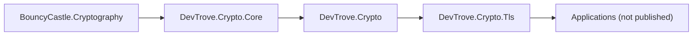

# NuGet packaging

> 中文对照：[nuget.zh-CN.md](nuget.zh-CN.md)

This document describes the package boundaries, versioning strategy and release process for `DevTrove.Crypto`.

---

## 1. Package list

| Package ID | Source repository | Role | Target frameworks |
|---|---|---|---|
| `DevTrove.Crypto` | this repo | **Metapackage (facade)**: stable public API | `netstandard2.0;netstandard2.1;net8.0;net9.0;net10.0` (target) |
| `DevTrove.Crypto.Core` | this repo | **Implementation**: BouncyCastle wrapper — algorithms, keys, ASN.1, X.509, CSR, PKCS#7/#12, CRL, OCSP parse | same as above |
| `DevTrove.Crypto.Tls` | this repo | TLS probe engine: protocol / cipher-suite matrices, extension parsing, grading, raw-byte probing | same as above |

**Note**: applications (the parent `DevTrove` repository and any external consumer) are **not** published — they are `IsPackable=false`.

> **Known deviation** (roadmap B1): Core currently targets `net8.0;net9.0;net10.0` (3 TFM). The 5-TFM strategy is the planned target; the metapackage today is `net10.0` only. Until both are unified, `dotnet build DevTrove.Crypto.slnx -c Release` fails with `NU1201`.

---

## 2. Package boundary principles

| # | Principle |
|---|---|
| 1 | **Data-format layer separate from network-protocol layer**: `DevTrove.Crypto` handles data only; never does network access |
| 2 | **`DevTrove.Crypto.Tls` depends on `DevTrove.Crypto`**, no duplicate ASN.1 / X.509 / PKCS parsing |
| 3 | **Library has no application dependency**: `DevTrove.Crypto.Tls` ships its own result models, does not reference `DevTrove.Core` |
| 4 | **Zero framework dependencies**: no DI, logging, ASP.NET Core; logging is the caller's responsibility |
| 5 | **Metapackage / implementation split**: consumers reference `DevTrove.Crypto`; `DevTrove.Crypto.Core` is pulled in transitively and may be swapped without breaking the public contract |
| 6 | **Pure-managed**: no native dependencies, no `runtimes/<rid>/native` packaging |

### Dependency graph



---

## 3. Versioning

### 3.1 Independent versions

The three packages have **independent version numbers**, not tied to the application's version.

| Scenario | Version action |
|---|---|
| New API (backward compatible) | Minor bump |
| Bug fix | Patch bump |
| Breaking change | Major bump (before `1.0.0`, breaking changes are allowed in Minor, but must be highlighted in CHANGELOG) |
| Doc / comment only | No bump (or noted in Patch) |

### 3.2 Dependency version declaration

`DevTrove.Crypto.Tls` declares a **minimum compatible version** of `DevTrove.Crypto`:

```xml
<PackageReference Include="DevTrove.Crypto" Version="[1.2.0, )" />
```

- Use a **lower-bound constraint** (`[x.y.z, )`) to permit consumers to upgrade to compatible newer versions.
- If a version introduces an incompatible change, bump the lower bound and the own Major simultaneously.

### 3.3 Pre-release versions

Early versions use `-dev` / `-preview` suffixes (e.g. `0.3.0-dev`) to avoid being referenced in production.

### 3.4 Library version start

`0.0.1-dev` → iterate as `0.0.X-dev` → `0.1.0` once capability is complete. Breaking changes are allowed in `0.x` but must be flagged in CHANGELOG.

---

## 4. Required package metadata

Each publishable package **must** declare the following in `Directory.Build.props`:

| Property | Requirement |
|---|---|
| `PackageId` | `DevTrove.*` naming |
| `Version` | Explicit; no implicit default |
| `Authors` / `Company` | Required |
| `Description` | Required; what the package does |
| `PackageTags` | Search-friendly (e.g. `tls`, `x509`, `crypto`, `sm2`, `sm3`, `sm4`, `gm`, `certificate`) |
| `PackageLicenseExpression` | `Apache-2.0` — **must match the repo `LICENSE` file** |
| `RepositoryUrl` / `RepositoryType` | `git` |
| `PackageProjectUrl` | Project home page |
| `PackageReadmeFile` | Points to the README shipped with the package |
| `GenerateDocumentationFile` | `true` — **otherwise the package has no XML docs and consumers get no IntelliSense** |
| `IncludeSymbols` + `SymbolPackageFormat` | `true` + `snupkg` for debugging |
| `IsPackable` | `true` |

**Recommendation**: enable SourceLink so consumers can jump straight to the source.

### Common mistakes

| Mistake | Consequence |
|---|---|
| Only `PackageId` set; `Description` / `License` missing | nuget.org page lacks info; may be rejected |
| Forgot `GenerateDocumentationFile` | No XML in package; DX drops significantly |
| `PackageLicenseExpression` disagrees with repo `LICENSE` | License contradiction; compliance risk |
| `PackageReadmeFile` declared but README not included | Pack fails |

---

## 5. Multi-target frameworks (target)

All three packages target (eventually):

```
netstandard2.0;netstandard2.1;net8.0;net9.0;net10.0
```

| Target | Purpose |
|---|---|
| `netstandard2.0` | .NET Framework 4.6.2+, Unity, etc. |
| `netstandard2.1` | .NET Core 3.x hosts |
| `net8.0` / `net9.0` | Current LTS / STS |
| `net10.0` | Application main target; latest API |

### `netstandard2.0` notes

- Some types / APIs are unavailable; need conditional compilation or compatibility packages.
- Restoring this target enables compilation paths that are currently excluded — **probe first**.
- The test matrix must cover this target (at least build success).

> Today Core targets 3 TFM and the metapackage 1 TFM; see [roadmap.md §7 B1](roadmap.md) for the planned 5-TFM form and the `Compat/` polyfill (B3).

---

## 6. Release process

### 6.1 Local pack

```
dotnet pack <project> -c Release -o ./artifacts --include-symbols
```

Produces `*.nupkg` + `*.snupkg`.

### 6.2 CI release

| Trigger | Action |
|---|---|
| Push to `main` | Build + test (no publish) |
| Pull Request | Build + test (no publish) |
| Push `v*` tag | Build + test + pack + publish to nuget.org (`--skip-duplicate`) |

**Publish order** (`DevTrove.Crypto.Tls` depends on `DevTrove.Crypto`):

1. `DevTrove.Crypto.Core`
2. `DevTrove.Crypto`
3. `DevTrove.Crypto.Tls`

NuGet doesn't support atomic multi-package publishing. New versions should **publish the dependency first**, then update consumers, or follow the order above in CI to avoid "dependency bumped but dependency not yet published" windows.

> **Known deviation** (roadmap B7): the `publish` job in `.github/workflows/build.yml` currently runs `dotnet pack ... --no-build` without a preceding `dotnet build`, and the push step globs `DevTrove.Crypto.*.nupkg` which double-matches the Core package. Both are tracked for fix.

### 6.3 Key management

- API key injected via CI encrypted secrets.
- **Never** write the API key into the repo, scripts or logs.
- Rotate the API key periodically.

---

## 7. Prefix reservation

NuGet supports **package-id prefix reservation** to prevent others publishing under the same prefix (avoid confusion / impersonation).

Reserving `DevTrove.*` requires proving ownership of the prefix (typically via domain or repo ownership).

**Recommendation**: register a domain matching the product name first, then apply for the prefix reservation.

---

## 8. Release artifact checklist

Verify before each release:

- [ ] `dotnet pack` succeeds; produces `.nupkg` + `.snupkg`
- [ ] Package contains XML documentation file (`lib/<tfm>/*.xml`)
- [ ] Package contains the README (if `PackageReadmeFile` declared)
- [ ] `PackageLicenseExpression` matches repo `LICENSE`
- [ ] Every target framework has a `lib/<tfm>/` directory
- [ ] **No native libraries in the package** (no `runtimes/*/native/`)
- [ ] Restores and calls API successfully in a clean environment (e.g. a `netstandard2.0` empty project)
- [ ] Dependency declared as lower-bound, not exact version
- [ ] CHANGELOG updated (English + Chinese)
- [ ] Version follows SemVer

---

## 9. Consumption

Consumers reference the metapackage only:

```
dotnet add package DevTrove.Crypto     # algorithms + certificates
dotnet add package DevTrove.Crypto.Tls # TLS probe (auto-pulls DevTrove.Crypto)
```

`DevTrove.Crypto.Core` is pulled in as a transitive dependency and rarely needs to be referenced explicitly.

---

## 10. Cross-repo working

| Scenario | Practice |
|---|---|
| Dual-repo development | Work in `lib/Crypto` (single submodule); toggle to `ProjectReference` via conditional property |
| Release | Conditional property toggles to `PackageReference`, restore from nuget.org |
| Local un-published version coupling | Local NuGet feed (folder or local feed) |

**Note**: `ProjectReference` cannot automatically convert to a NuGet dependency. If `ProjectReference` is still in use at pack time, the produced package will be missing the `DevTrove.Crypto` dependency declaration and consumers will fail to restore. **Packaging must use `PackageReference` mode.**

> Today the conditional switch is not implemented (roadmap B6); packaging produces incomplete dependency metadata. Plan: introduce the switch before first stable release.

---

## 11. Related

| Document | Contents |
|---|---|
| [architecture.md](architecture.md) | Package layering, dependency direction, capability boundaries |
| [standards.md](standards.md) | Engineering files + metadata conventions |
| [roadmap.md](roadmap.md) | Phase A library transformation tasks |
| [development-guide.md](development-guide.md) | Build / test / pack commands |
| [library-api.md](library-api.md) | Public API index |
