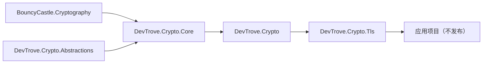

# NuGet 包规划

> 英文默认入口：[nuget.md](nuget.md)

本文档描述 `DevTrove.Crypto` 的包边界、版本策略与发布流程。

---

## 1. 包清单

| 包 ID | 所在仓库 | 职责 | 目标框架 |
|---|---|---|---|
| `DevTrove.Crypto.Abstractions` | 本仓 | **契约**：接口与抽象基类型；零包依赖 | `netstandard2.0;net8.0;net9.0;net10.0` |
| `DevTrove.Crypto.Core` | 本仓 | **实现**：BouncyCastle 封装、算法原语、密钥、ASN.1、X.509、CSR、PKCS#7/#12、CRL、OCSP 解析 | 同上 |
| `DevTrove.Crypto` | 本仓 | **门面包**：稳定的对外 API | 同上 |
| `DevTrove.Crypto.Tls` | 本仓 | TLS 探测引擎：协议 / 套件矩阵、扩展解析、评级、裸字节探测 | 同上 |

**注意**：消费本库的应用**不发布**（`IsPackable=false`）。本文档只涉及本仓产出的包。

> `netstandard2.1` 有意**不**作为目标。它在 `RM-0.0.14` 工作中被移除，因为没有任何未 EOL 的宿主会解析该资产，它永远无法被运行测试覆盖。保留下来的每个目标都有在 CI 中真正运行它的宿主。见 [roadmap.md](roadmap.md) §6.1。

---

## 2. 包边界原则

| # | 原则 |
|---|---|
| 1 | **数据格式层与网络协议层分离**：`DevTrove.Crypto` 只处理数据，不做任何网络访问 |
| 2 | **`DevTrove.Crypto.Tls` 依赖 `DevTrove.Crypto`**，不重复实现 ASN.1 / X.509 / PKCS 解析 |
| 3 | **不依赖应用层**：`DevTrove.Crypto.Tls` 自带结果模型，只依赖 `DevTrove.Crypto` |
| 4 | **核心库零框架依赖**：不引用 DI、日志、ASP.NET Core；日志由调用方决定 |
| 5 | **门面包与实现包分离**：使用方引用 `DevTrove.Crypto`；`DevTrove.Crypto.Core` 作为其依赖被自动引入，将来可替换实现而不破坏外部契约 |
| 6 | **契约与实现分离**：接口与抽象基类型放在 `DevTrove.Crypto.Abstractions`，它不引用任何包。消费方可仅对契约面编程；同时也使「公开签名中不得出现 BouncyCastle 类型」从评审规则变为可机器检查的不变量 |
| 7 | **纯托管**：不引入任何原生依赖，不打包 `runtimes/<rid>/native` |

### 依赖关系



---

## 3. 版本策略

### 3.1 每个里程碑一个版本号

四个包**在每个里程碑内共用同一个版本号**，不存在每包独立版本：一个里程碑要么全部发布，要么只发布已经存在的包（`DevTrove.Crypto.Abstractions` 与 `DevTrove.Crypto.Tls` 分别从 `0.1.0` 与 `0.6.0` 开始出现）。

**`0.x` 期间不提供 API 兼容承诺。** 次版本可能破坏公开 API；这类变更会在 `CHANGELOG.zh-CN.md` 中显著标注，且永不出现在 patch 版本里。面向消费者的表述在 [README.zh-CN.md](../README.zh-CN.md)，它随每个包一同发布。

| 场景 | 版本动作 |
|---|---|
| 新增 API（向后兼容） | Minor 递增 |
| 缺陷修复 | Patch 递增 |
| 破坏性变更 | Major 递增（`1.0.0` 之前允许在 Minor 中做破坏性变更，但需在 CHANGELOG 中显著标注） |
| 仅文档/注释变更 | 不递增（或在 Patch 中说明） |

### 3.2 依赖版本声明

`DevTrove.Crypto.Core` 对 `DevTrove.Crypto.Abstractions`、`DevTrove.Crypto.Tls` 对 `DevTrove.Crypto`，各自声明**最低可兼容版本**：

```xml
<PackageReference Include="DevTrove.Crypto.Abstractions" Version="[0.1.0, )" />
<PackageReference Include="DevTrove.Crypto" Version="[0.1.0, )" />
```

- 使用**下界约束**（`[x.y.z, )`），允许消费方升级到兼容的更高版本。`ProjectReference` 打包时产出的正是这个：无括号的最小版本，语义相同
- 若某版本引入了不兼容变更，则同时提升下界并递增自身的 Major
- **库处于 `0.x` 时，仅有下界是不够的**：浮动范围可能拉进破坏性的次版本。消费方应锁定确切版本（或自行加上上界），直至 `1.0.0` —— 见 [README.zh-CN.md](../README.zh-CN.md)

### 3.3 预发布版本

早期版本使用 `-dev` / `-preview` 后缀（如 `0.1.0-dev`），避免被生产环境误引用。

### 3.4 版本线起点

`0.0.1`–`0.0.14` **仅为工作项编号**：不打包、不打 tag、不发布。首个公开发布为 `0.1.0`，即第一个交付可用能力的里程碑 —— 纯重构性质的工作项不单独发布。`0.x` 期间允许破坏性变更，但必须在 CHANGELOG 中显著标注。见 [roadmap.md §3](roadmap.md)。

---

## 4. 包元数据要求（强制）

每个待发布的包**必须**在 `Directory.Build.props` 中声明以下属性：

| 属性 | 要求 |
|---|---|
| `PackageId` | `DevTrove.*` 命名 |
| `Version` | 显式声明，不使用隐式默认 |
| `Authors` / `Company` | 必填 |
| `Description` | 必填，说明该包做什么 |
| `PackageTags` | 便于检索（如 `tls`、`x509`、`crypto`、`sm2`、`sm3`、`sm4`、`gm`、`certificate`） |
| `PackageLicenseExpression` | `Apache-2.0`，**必须与仓库 `LICENSE` 文件一致** |
| `RepositoryUrl` / `RepositoryType` | `git` |
| `PackageProjectUrl` | 项目主页 |
| `PackageReadmeFile` | 指向随包发布的 README |
| `GenerateDocumentationFile` | `true` —— **否则包内不含 XML 文档，使用方无 IntelliSense 提示** |
| `IncludeSymbols` + `SymbolPackageFormat` | `true` + `snupkg`，便于调试 |
| `IsPackable` | `true` |

**建议**：启用 SourceLink，使使用方可直接跳转到源码。

> `<Version>`（`0.1.0-dev`，预备首发时推进）、各包显式 `<PackageId>` 与 SourceLink（Microsoft.SourceLink.GitHub）已声明。`dotnet pack` 产出 `DevTrove.Crypto.Abstractions.<version>.nupkg`、`DevTrove.Crypto.Core.<version>.nupkg`、`DevTrove.Crypto.<version>.nupkg`，含 README + 各 TFM 的 lib/ 与 .xml；对应的 snupkg 在 pdb 内嵌入 SourceLink JSON。
>
> 打包出来的 `DevTrove.Crypto.Core` 必须在其 `.nuspec` 中声明 `<dependency id="DevTrove.Crypto.Abstractions" />`。`ProjectReference` 并不总能变成 NuGet 依赖，所以这一项靠**解包 `.nupkg` 验证**，而不是假定 —— 见 §8。

### 常见错误

| 错误 | 后果 |
|---|---|
| 只写 `PackageId` 而漏掉 `Description` / `License` | 包页信息缺失，且可能被 nuget.org 校验拒绝 |
| 忘记 `GenerateDocumentationFile` | 包内无 XML 注释，DX 显著下降 |
| `PackageLicenseExpression` 与 `LICENSE` 文件不一致 | 许可证表述矛盾，存在合规风险 |
| 未声明 `PackageReadmeFile` 却引用了 README | 打包失败 |

---

## 5. 多目标框架

四个包统一使用：

```
netstandard2.0;net8.0;net9.0;net10.0
```

| 目标 | 目的 | CI 中运行它的宿主 |
|---|---|---|
| `netstandard2.0` | 覆盖 .NET Framework 4.6.2+、Unity 等宿主 | Windows 上的 `net48` 测试项目 |
| `net8.0` / `net9.0` | 覆盖当前的 LTS / STS 宿主 | 同 TFM 测试宿主 |
| `net10.0` | 应用主目标，可使用最新 API | 同 TFM 测试宿主 |

### `netstandard2.0` 注意事项

- 部分类型与 API 不可用，需条件编译或引入兼容包
- 守卫符号必须**按 API 分别选**，不能用一个笼统符号：`Convert.FromHexString` 在所有 `netstandard` 目标上都不存在，而 `HashAlgorithm.HashCore(ReadOnlySpan<byte>)` 只在 `netstandard2.0` 上缺失。该目标上的 `Span<T>` 来自 `System.Memory` 包
- 测试矩阵必须覆盖该目标 —— 也确实覆盖了：`net48` 宿主会解析 `netstandard2.0` 资产并对它跑契约测试，因此该资产是**运行验证**而非仅构建验证

> `netstandard2.1` 有意缺席。没有任何未 EOL 的宿主会解析该资产，它永远无法被运行验证；已在 `RM-0.0.14` 工作中从目标集合移除。见 [roadmap.md](roadmap.md) §6.1。

---

## 6. 发布流程

### 6.1 本地打包

```
dotnet pack <project> -c Release -o ./artifacts --include-symbols
```

产出：`*.nupkg` + `*.snupkg`

### 6.2 CI 发布

CI 拆为两个 workflow，使分支检查与 tag 触发的发布相互独立、可分别审计。完整 job 布局见 [development-guide.zh-CN.md §6](development-guide.zh-CN.md)。

| Workflow | 触发 | 动作 |
|---|---|---|
| `.github/workflows/ci.yml` | 仅 `main` 的 `push` / `pull_request`，外加 `workflow_call` 与 `workflow_dispatch` | 构建 + 测试；仅 `push`（非 PR）时打包至 `./artifacts/`（**不**推 nuget.org） |
| `.github/workflows/release.yml` | `v*` 标签 `push` | 校验不变量 → 重跑 CI → 重新打包 + 推 nuget.org + 创建 GitHub Release |

#### 版本守卫（`release.yml` / `verify-version`）

发布 workflow **不**注入版本号。维护者直接编辑 `Directory.Build.props` 中的 `<Version>`；`verify-version` 读取该文件，与推送的标签逐项比对四项不变量，任一不匹配即拒绝继续：

| 不变量 | 期望 |
|---|---|
| `<Version>` | 与标签版本一致（如 `v0.6.0` 对应 `<Version>0.6.0</Version>`） |
| `<PackageLicenseExpression>` | `Apache-2.0` |
| `<TargetFrameworks>` | 包含全部 `netstandard2.0;net8.0;net9.0;net10.0` |
| `<RepositoryUrl>` | 包含 `DevTrove.Crypto` |

任一不匹配通过 `::error::` annotation 立即终止，**绝不**进入 `dotnet pack`、`dotnet nuget push` 或 GitHub Release 步骤。tag 版本段含 `-`（如 `v1.0.0-rc.1`）即判定为预发布。

#### 发布顺序

（`DevTrove.Crypto.Core` 依赖 `DevTrove.Crypto.Abstractions`；`DevTrove.Crypto.Tls` 依赖 `DevTrove.Crypto`。）

1. `DevTrove.Crypto.Abstractions`
2. `DevTrove.Crypto.Core`
3. `DevTrove.Crypto`
4. `DevTrove.Crypto.Tls`

由于 NuGet 不支持原子多包发布，新版本发布时应**先发包、后打标签**，或在 CI 中按上述顺序依次推送，避免出现"依赖已升级但被依赖的包尚未发布"的窗口期。`release.yml` 的推送 glob 严格拆分：Core 用 `DevTrove.Crypto.Core.*.nupkg`，门包用 `DevTrove.Crypto.[0-9]*.nupkg`。

#### GitHub Release

`softprops/action-gh-release@v2` 把 `artifacts/*.nupkg` + `artifacts/*.snupkg` 附到 Release；`fail_on_unmatched_files: true` 让缺失立刻报错；`prerelease` 取自 `verify-version` job 的输出。

### 6.3 密钥管理

- API Key 通过 CI 的加密 Secret 注入
- **不**将 API Key 写入仓库、脚本或日志
- 定期轮换 API Key

---

## 7. 前缀预留

NuGet 支持申请 **Package ID 前缀预留**，防止他人在同一前缀下发布包（造成混淆或仿冒）。

申请 `DevTrove.*` 需要验证对该前缀的所有权（通常通过域名或仓库所有权验证）。

**建议**：先注册与产品名一致的域名，再申请前缀预留。

---

## 8. 发布产物验证清单

每次发布前逐项确认：

- [ ] `dotnet pack` 成功，产出 `.nupkg` 与 `.snupkg`
- [ ] 包内包含 XML 文档文件（`lib/<tfm>/*.xml`）
- [ ] 包内含 README（若声明了 `PackageReadmeFile`）
- [ ] `PackageLicenseExpression` 与仓库 `LICENSE` 一致
- [ ] 所有目标框架均有 `lib/<tfm>/` 目录
- [ ] **包内不含任何原生库**（无 `runtimes/*/native/`）
- [ ] 解包 `DevTrove.Crypto.Core.<version>.nupkg` 后，其 `.nuspec` 中出现 `<dependency id="DevTrove.Crypto.Abstractions" />`
- [ ] 在干净环境（如 `netstandard2.0` 空项目）中还原并调用 API 成功
- [ ] 依赖声明为下界约束而非精确版本
- [ ] CHANGELOG 已更新（中英双份）
- [ ] 版本号符合语义化版本规则

---

## 9. 消费方式

使用方只需引用门面包：

```
dotnet add package DevTrove.Crypto     # 加密与证书能力
```

`DevTrove.Crypto.Core` 与 `DevTrove.Crypto.Abstractions` 作为传递依赖自动引入，一般无需显式引用。只有在需要「只要契约面、不要 BouncyCastle 实现」时才直接引用 `DevTrove.Crypto.Abstractions` —— 它是这套包里唯一不依赖任何其他包的包。

---

## 10. 使用方如何引用

| 场景 | 做法 |
|---|---|
| 引用包 | 对 `DevTrove.Crypto`（探测能力则加 `DevTrove.Crypto.Tls`）加 `PackageReference`，版本约束用下界，例如 `[0.1.0, )` |
| 联调未发布版本 | 发布到本地文件夹 feed，让消费方指向它 |

消费方如何在项目引用与包引用之间取舍，属消费方决策，本文档有意不涉及。**注意**：`ProjectReference` 并不总能变成 NuGet 依赖 —— 应解包验证 `.nuspec`（见 §8），而不是假定，否则使用方会还原失败。

---

## 11. 相关文档

| 文档 | 内容 |
|---|---|
| [architecture.md](architecture.md) | 包在整体架构中的位置与依赖方向 |
| [standards.md](standards.md) | 工程文件与元数据规范 |
| [roadmap.md](roadmap.md) | 版本线、逐项状态与证据 |
| [development-guide.md](development-guide.md) | 构建/测试/打包命令 |
| [library-api.md](library-api.md) | 公开 API 索引 |
