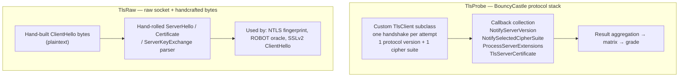

# TLS probe engine design

> 中文对照：[tls-scanner.zh-CN.md](tls-scanner.zh-CN.md)

This document describes the design of `DevTrove.Crypto.Tls`: capability boundaries, engine layering, matrix implementation, grading algorithm and ShangMi detection.

---

## 1. Capability levels

| Level | Content | This project |
|---|---|---|
| **L1** | Protocol version matrix, cipher-suite matrix, extension fingerprint, server-sent certificate chain, negotiated groups & signature algorithms | ✅ Scheduled (`0.6.0`) |
| **L2** | L1 + A–F grading, client-simulation compatibility matrix, ALPN/HTTP2, certificate transparency, DNS CAA | ✅ Scheduled (`0.7.0`) |
| **L3** | L2 + vulnerability probing (Heartbleed, CCS Injection, ROBOT, Ticketbleed, etc.) | ❌ Only ROBOT (see §9.3) |

This document owns the **design**. The **schedule and per-item status** live in [roadmap.md](roadmap.md) §6.18 and §6.19.

---

## 2. Engine layering

The two layers are independent; results are merged at the application layer.

---

## 3. Why not .NET-native `SslStream`

| Limitation | Impact |
|---|---|
| `CipherSuitesPolicy` carries `[UnsupportedOSPlatform("windows")]` | **Cannot constrain cipher suites on Windows**, so the suite matrix is impossible |
| Does not expose raw handshake bytes | Cannot get the full server extension set |
| Does not expose OCSP stapling responses | Cannot detect stapled OCSP |
| Does not expose SCT (certificate timestamp) | Cannot detect embedded CT |
| No extension control | Cannot do client-capability simulation |

Conclusion: `SslStream` yields only the "single negotiation result" — **cannot build a matrix**, so it's not suitable for a scanner.

---

## 4. Why BouncyCastle

| Advantage | Note |
|---|---|
| **Full protocol-version coverage** | `ProtocolVersion.SSLv3` (`0x0300`) exists, and `CLIENT_EARLIEST_SUPPORTED_TLS = SSLv3` → pure-managed enumeration of SSLv3 ~ TLS 1.3 |
| **No host-policy dependency** | Doesn't depend on OpenSSL, so not affected by "OpenSSL 3 disables TLS <1.2 by default" |
| **Callback API gives complete information** | `TlsClient` hooks let us read each negotiated field and server extension |
| **Pure-managed** | Cross-platform consistent; also compiles into WebAssembly and into trimmed / AOT builds (for certificate parsing and similar local work) |
| **RFC 8998 built in** | see §8.1 |

### Key API hooks

| Hook | Purpose |
|---|---|
| `GetSupportedVersions()` | Declare offered protocol versions |
| `GetCipherSuites()` | Declare offered suites (one per attempt for single-point probing) |
| `GetClientExtensions()` | Fine-grained control of sent extensions |
| `NotifyServerVersion(ProtocolVersion)` | Capture negotiated server version |
| `NotifySelectedCipherSuite(int)` | Capture negotiated cipher suite |
| `ProcessServerExtensions(IDictionary<int, byte[]>)` | **Capture the full server extension set** |
| `TlsAuthentication` / `TlsServerCertificate` | Capture server-sent certificate chain |
| `CertificateStatus` | Capture stapled OCSP response |
| `NotifyNewSessionTicket` | Detect session-ticket support |

---

## 5. Protocol version matrix

For each candidate version (SSLv3 / TLS 1.0 / 1.1 / 1.2 / 1.3) attempt one handshake, declaring only that version:

| Result | Verdict |
|---|---|
| Handshake succeeds and negotiated version == target | Supported |
| Handshake fails / `protocol_version` alert | Not supported |
| Negotiates a lower version | Target version supported but downgrade present (record separately) |

Each probe uses an independent connection to avoid session-resumption interference.

---

## 6. Cipher-suite matrix

**Method**: probe each candidate suite in isolation; **only one suite** declared per handshake.

| Result | Verdict |
|---|---|
| Negotiated suite == target | Supported |
| Handshake fails / `handshake_failure` | Not supported |

### Suite classification

Results are tagged by security group:

| Group | Examples |
|---|---|
| Secure | ECDHE + AES-GCM / ChaCha20-Poly1305 |
| Weak | CBC mode, 3DES, RC4 |
| Deprecated | RSA key exchange, NULL encryption, EXPORT-grade |
| ShangMi | SM4-GCM/CBC + SM3 (see §8) |

### Caveats

- Each probe establishes an independent connection; concurrency must be rate-limited to avoid being flagged as an attack.
- For failures, distinguish "suite not supported" from "connection-layer failure" — the latter must not count toward the matrix.
- The suite set must be configurable, so the matrix can be updated as standards evolve.

---

## 7. Extension fingerprint

Use `ProcessServerExtensions` to capture the server extension set and derive:

| Extension | Verdict |
|---|---|
| `signed_certificate_timestamp` | Whether the cert embeds an SCT; combine both TLS extension and certificate extension checks |
| `status_request` + `CertificateStatus` | Whether OCSP stapling is enabled |
| `extended_master_secret` | Whether EMS is enabled |
| `session_ticket` / `NewSessionTicket` | Session-resumption mechanism |
| `application_layer_protocol_negotiation` | ALPN negotiation result |
| `renegotiation_info` | Secure-renegotiation support (RFC 5746) |
| `supported_versions` | Actual version negotiation under TLS 1.3 |
| `key_share` | TLS 1.3 key-exchange group |
| `signature_algorithms` (TLS 1.2: server shouldn't send) | Protocol-conformance anomaly |

### Required exception handling

BouncyCastle **strictly validates** server extensions: `AbstractTlsClient.ProcessServerExtensions` throws an `illegal_parameter` fatal alert when it sees an extension the client didn't advertise.

**Requirement**: the probe driver must catch this exception and **downgrade to "record the exception"**, not fail the whole scan. This is the most common cause of "scan mysteriously fails on certain servers".

---

## 8. ShangMi (Chinese national cryptography)

### 8.1 RFC 8998 — SM2-TLS 1.3

BouncyCastle **already has** these elements:

| Element | Value |
|---|---|
| Cipher suites | `TLS_SM4_GCM_SM3 = 0x00C6`, `TLS_SM4_CCM_SM3 = 0x00C7` |
| PRF | `tls13_hkdf_sm3` |
| Signature schemes | SM2 (`sm2sig_sm3`) |
| Curves | `curveSM2`, plus hybrid `curveSM2MLKEM768` |

So RFC 8998 **theoretically supports a full handshake** (not only detection). The verification item is `RM-0.7.0-08`; if it proves feasible, SM2-TLS 1.3 lands in the `TlsProbe` engine.

### 8.2 NTLS / GB/T 38636 — dual-certificate ShangMi TLS

NTLS has three **structural** differences from standard TLS:

| Difference | Where | Value |
|---|---|---|
| Protocol version | record layer / `legacy_version` in ClientHello | `0x0101` (not `0x0303`) |
| Cipher suites | `cipher_suites` in ClientHello | `0xE011`, `0xE013`, `0xE051`, `0xE053`, … |
| Dual certificate | Certificate message | One signing cert + one encryption cert, both SM2 |

**NTLS has no dedicated TLS extension** — dual certificates ride on the handshake messages; no extension negotiation.

### 8.3 Why NTLS can't be implemented via BouncyCastle's protocol stack

| Blocker | Note |
|---|---|
| Version rejected | `ProtocolVersion.IsSupportedTlsVersionClient` constrains `FullVersion ∈ [0x0300, 0x0304]`; `0x0101` is rejected outright; `legacy_version` is hard-coded in the protocol layer — `TlsClient` cannot intervene |
| Suites unrecognized | `0xE0xx` not recognized by the key-exchange factory or PRF selection — receiving a ServerHello breaks |
| Missing algorithm wiring | BouncyCastle has no GB/T 38636 ECC/ECDHE-SM2 key-exchange implementation |

### 8.4 NTLS detection (`TlsRaw` engine)

**Key insight**: `ClientHello`, `ServerHello`, `Certificate` and `ServerKeyExchange` are **all plaintext** in TLS 1.2 (ServerKeyExchange is only signed, transport is unencrypted).

So NTLS detection **requires zero cryptographic implementation**, only "build bytes + parse bytes":

| Step | Content |
|---|---|
| 1 | Handcraft a ClientHello: `legacy_version = 0x0101`, `cipher_suites` containing `0xE011/0xE013/0xE051/0xE053`, `signature_algorithms` containing SM2, SNI and standard extensions |
| 2 | Read the server response byte stream |
| 3 | Hand-parse ServerHello: negotiated version, selected suite, extension list |
| 4 | Hand-parse Certificate: extract the two SM2 certificates (DER), hand them to `DevTrove.Crypto` for parsing |
| 5 | Hand-parse ServerKeyExchange: signature algorithm, curve, signature value (BouncyCastle `SM2Signer` can verify the signature) |

**Conclusions produced**: NTLS support, negotiated version, negotiated suite, dual-certificate presence and SM2-ness, server signature algorithm and curve, OCSP staple presence.

### 8.5 NTLS full handshake (out of scope)

A full handshake requires implementing a TLS 1.2 subset:

| Module | Content |
|---|---|
| record layer | Fragmentation, encryption, MAC, length validation |
| SM3 PRF | Master secret, key block, Finished `verify_data` derivation |
| SM2 key exchange | `ECDHE_SM4_*` (ephemeral pub exchange) + `ECC_SM4_*` (encrypt pre-master with encryption-cert pub) |
| SM4 record protection | CBC (implicit IV + padding) + HMAC-SM3; GCM (AEAD) |
| Dual-cert handling | Distinguish signing-cert vs encryption-cert roles |
| Handshake state machine | Finished validation, alerts, renegotiation rejection |

Roughly 2–4 weeks of work, with concentrated risk on national-standard details (IV generation, padding, MAC ordering, PRF labels, signature encoding). GB/T 38636 is a paid standard; there is no freely-available authoritative text to cross-check against.

**Conclusion**: deferred to v2 evaluation; only kick off when there is a concrete "simulate ShangMi client" demand.

---

## 9. Explicit non-goals

### 9.1 Heartbleed

Requires sending a malformed heartbeat record and reading the unencrypted response. BouncyCastle's `TlsProtocol.ProcessRecord` heartbeat branch **is commented out**; cannot reuse. Self-implementation needs the full record layer + key derivation.

### 9.2 CCS Injection / Ticketbleed

Same — both require malformed records or precise record-layer byte control.

### 9.3 ROBOT (in scope)

ROBOT is the RSA key-exchange padding-oracle detection; it only needs to send **differently constructed ClientHellos** and observe response differences. These messages are plaintext, so it fits into the `TlsRaw` engine.

### 9.4 No `testssl.sh` packaging

Its license is **GPLv2**, so it cannot be shipped with this project. Only as an optional external cross-check tool during development.

---

## 10. Grading algorithm (L2)

Compute an A–F grade from scan results; reference public grading approaches and **implement independently**.

### Inputs

| Dimension | Note |
|---|---|
| Protocol support | SSLv3 / TLS 1.0 / 1.1 (deductions); TLS 1.3 (bonus) |
| Key strength | Leaf cert + intermediates — algorithm and length |
| Signature algorithm | SHA-1 / MD5 signatures (deduction) |
| Suite strength | Weak suites (RC4, 3DES, CBC, RSA key exchange) |
| Cert validity | Expired / self-signed / hostname mismatch / chain completeness |
| Extensions & features | HSTS, OCSP stapling, SCT, secure renegotiation |
| ShangMi | RFC 8998 / NTLS support (shown as feature, not directly scored) |

### Requirements

- Every deduction must give an **explainable reason** (point to concrete evidence) in the output
- Grading result must carry an algorithm version for later tuning
- Grading is separate from "detection conclusions": produce facts first, then grade

---

## 11. Client-simulation matrix (L2)

Simulate handshakes by mainstream-client capability sets; output a compatibility matrix:

| Simulated | | Variable dimensions |
|---|---|---|
| Chrome / Edge | Protocol set, suites, signature algorithms, groups |
| Firefox | | Same |
| Safari | | Same |
| Java (each LTS) | Protocol & suite sets differ significantly |
| Android | Version-dependent suite differences |

Each client is an independent probe path; output "this client can handshake successfully" + "negotiated result".

---

## 12. Result models

`DevTrove.Crypto.Tls` ships its own result models; no application dependency. Main entities:

| Entity | Content |
|---|---|
| `TlsScanReport` | Top-level report: target, time, duration, sub-results |
| `ProtocolMatrix` | Per-version support + negotiation result |
| `CipherSuiteMatrix` | Per-suite support + grouping |
| `ExtensionFingerprint` | Server extension set + per-item verdict |
| `CertificateChainInfo` | Server-sent chain order + per-cert parse result |
| `OcspStaplingInfo` | Stapling presence + response parse |
| `NtlsFingerprint` | NTLS verdicts (version, suite, dual cert) |
| `GradeResult` | Grade + deduction list + reasons |
| `ClientSimulationMatrix` | Per-client simulation result |
| `ProbeDiagnostics` | Exceptions + downgrade records during probing (**must be exposed** to avoid silent failure) |

The library ships these models itself; consumers map them to their own contract types.

---

## 13. Performance & concurrency

| Aspect | Strategy |
|---|---|
| Probe granularity | Each suite probe must establish an independent connection; no session reuse |
| Concurrency | Limit concurrent connections to a single target (avoid being flagged as an attack) |
| Timeout | Independent timeout per connection; whole scan has an overall timeout |
| Single-suite probe failure | Fail fast; no retry (retry significantly lengthens scan time) |
| Caching | No cross-request caching; intra-session re-probes may reuse results |

---

## 14. Security requirements

A scanner is a typical **SSRF high-risk surface** (the server opens connections to user-supplied addresses), requirements:

| Requirement | Note |
|---|---|
| Target address validation | Deny `127.0.0.0/8`, `10.0.0.0/8`, `172.16.0.0/12`, `192.168.0.0/16`, `169.254.0.0/16`, `::1`, `fc00::/7` and other internal/reserved ranges |
| DNS-rebinding protection | Validate the resolved IP, not just the domain |
| Redirect limits | Limit hop count; revalidate each hop |
| Port limits | Default only 443 and common TLS ports; other ports require explicit opt-in |
| Rate limiting | Per-IP and global limits |
| Timeout & size limits | Strict connection timeout + read-byte cap |

These controls belong to whoever hosts the engine. This library provides the building blocks (raw probing capability) and assumes the caller applies them.

---

## 15. Testing & cross-validation

| Approach | Note |
|---|---|
| **Public test sites** | Probe the `badssl.com` family (expired, self-signed, hostname mismatch, RC4, 3DES, no SNI, TLS 1.0-only, etc.) to verify verdicts |
| **Cross-validation** | Compare with `openssl s_client` and `testssl.sh` outputs (**manual local execution, not in CI**) |
| **NTLS fixture replay** | Capture `ServerHello` / `Certificate` / `ServerKeyExchange` bytes from public ShangMi sites into the **tracked** `tests/fixtures/ntls/`; verify parse and verdict logic directly — no national-crypto protocol stack is required on the machine |
| **Golden-file snapshot** | Pin one complete scan result as JSON to prevent regression |
| **Exception paths** | Construct "server sends unusual extensions" scenarios to verify the whole scan doesn't fail |

---

## 16. Related

| Document | Contents |
|---|---|
| [architecture.md](architecture.md) | Where the engine sits in the overall architecture |
| [standards.md](standards.md) | Coding & testing conventions |
| [roadmap.md](roadmap.md) | Version line, per-item status and evidence |
| [development-guide.md](development-guide.md) | Build / test / pack |
| [library-api.md](library-api.md) | Public API index (engine section) |
