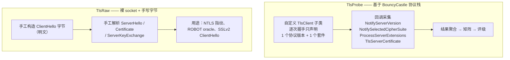

# TLS 探测引擎设计

> 英文默认入口：[tls-scanner.md](tls-scanner.md)

本文档描述 `DevTrove.Crypto.Tls` 的设计：能力边界、引擎分层、矩阵实现、评级算法与国密检测方案。

---

## 1. 能力等级定义

| 等级 | 内容 | 本项目 |
|---|---|---|
| **L1** | 协议版本矩阵、密码套件矩阵、扩展指纹、服务端实发证书链、协商群与签名算法 | ✅ 已排期（`0.4.0`） |
| **L2** | L1 + A~F 评级、客户端模拟兼容性矩阵、ALPN/HTTP2、证书透明度、DNS CAA | ✅ 已排期（`0.5.0`） |
| **L3** | L2 + 漏洞探测（Heartbleed、CCS Injection、ROBOT、Ticketbleed 等） | ❌ 仅 ROBOT（见 §9.3） |

本文档描述**设计**；**排期与逐项状态**见 [roadmap.md](roadmap.md) §6.17 与 §6.18。

---

## 2. 引擎分层

两层各自独立，结果在调用方合并。

---

## 3. 为什么不用 .NET 原生 `SslStream`

| 限制 | 影响 |
|---|---|
| `CipherSuitesPolicy` 标注 `[UnsupportedOSPlatform("windows")]` | **Windows 上无法限定套件**，套件枚举矩阵无法实现 |
| 不暴露原始握手字节 | 无法获取服务端扩展的全集 |
| 不暴露 OCSP stapling 响应 | 无法检测 stapled OCSP |
| 不暴露 SCT（签名证书时间戳） | 无法检测 CT 嵌入情况 |
| 无扩展控制能力 | 无法做客户端能力模拟 |

结论：`SslStream` 只能得到"单次协商结果"，**无法构造矩阵**，不适用于扫描器。

---

## 4. 为什么用 BouncyCastle

| 优势 | 说明 |
|---|---|
| **协议版本覆盖完整** | `ProtocolVersion.SSLv3`（`0x0300`）存在，且 `CLIENT_EARLIEST_SUPPORTED_TLS = SSLv3` → 纯托管即可枚举 SSLv3 ~ TLS 1.3 |
| **不受系统策略限制** | 不依赖 OpenSSL，因此不受"OpenSSL 3 默认禁用 TLS 1.2 以下"之类策略影响 |
| **回调式 API 提供完整信息** | `TlsClient` 钩子可逐字段获取协商结果与服务端扩展 |
| **纯托管** | 可跨平台一致，且可编译进 WebAssembly 与裁剪 / AOT 构建（用于证书解析等本地能力） |
| **RFC 8998 已内建** | 见 §8.1 |

### 关键 API 钩子

| 钩子 | 用途 |
|---|---|
| `GetSupportedVersions()` | 声明本次握手提供的协议版本 |
| `GetCipherSuites()` | 声明本次握手提供的套件（每次只放 1 个即可单点探测） |
| `GetClientExtensions()` | 精确控制发送哪些扩展 |
| `NotifyServerVersion(ProtocolVersion)` | 采集服务端选择的版本 |
| `NotifySelectedCipherSuite(int)` | 采集服务端选择的套件 |
| `ProcessServerExtensions(IDictionary<int, byte[]>)` | **采集服务端扩展全集** |
| `TlsAuthentication` / `TlsServerCertificate` | 采集服务端实发证书链 |
| `CertificateStatus` | 采集 stapled OCSP 响应 |
| `NotifyNewSessionTicket` | 判断会话票据支持 |

---

## 5. 协议版本矩阵

对每个候选版本（SSLv3 / TLS 1.0 / 1.1 / 1.2 / 1.3）各发起一次握手，只声明该版本：

| 结果 | 判定 |
|---|---|
| 握手成功且协商版本 == 目标 | 支持 |
| 握手失败 / 收到 `protocol_version` alert | 不支持 |
| 协商到更低版本 | 支持目标版本但存在降级（需单独记录） |

每次探测独立建连，避免会话复用干扰。

---

## 6. 密码套件矩阵

**方法**：对候选套件集合逐个探测，每次握手**只声明一个套件**。

| 结果 | 判定 |
|---|---|
| 协商套件 == 目标 | 支持 |
| 握手失败 / `handshake_failure` | 不支持 |

### 套件分级

结果表格中按安全性分组标注：

| 分组 | 示例 |
|---|---|
| 安全 | ECDHE + AES-GCM / ChaCha20-Poly1305 |
| 弱 | CBC 模式、3DES、RC4 |
| 已废弃 | RSA 密钥交换、NULL 加密、EXPORT 级套件 |
| 国密 | SM4-GCM/CBC + SM3（见 §8） |

### 注意事项

- 每次探测建立独立连接；并发需限流，避免被目标判定为攻击
- 对失败结果需区分"套件不支持"与"连接层失败"，后者不得计入矩阵
- 套件集合需可配置，便于随标准演进而更新

---

## 7. 扩展指纹

通过 `ProcessServerExtensions` 采集服务端扩展，形成以下判定：

| 扩展 | 判定含义 |
|---|---|
| `signed_certificate_timestamp` | 证书是否嵌入 SCT；结合 TLS 扩展与证书扩展两方面判断 |
| `status_request` + `CertificateStatus` | 是否启用 OCSP stapling |
| `extended_master_secret` | 是否启用扩展主密钥（EMS） |
| `session_ticket` / `NewSessionTicket` | 会话恢复机制 |
| `application_layer_protocol_negotiation` | ALPN 协商结果 |
| `renegotiation_info` | 安全重协商支持（RFC 5746） |
| `supported_versions` | TLS 1.3 下的实际版本协商 |
| `key_share` | TLS 1.3 的密钥交换群 |
| `signature_algorithms`（TLS 1.2 下服务端不应发送） | 协议合规性异常 |

### 必须处理的异常

BouncyCastle 对服务端扩展是**严格校验**的：`AbstractTlsClient.ProcessServerExtensions` 遇到"客户端未声明却收到"的扩展会抛出 `illegal_parameter` 致命告警。

**要求**：探测驱动必须捕获该异常并**降级为"记录该异常"**，而不是让整场扫描失败。这是实现中最容易导致"扫描对某些服务器莫名失败"的地方。

---

## 8. 国密（ShangMi）

### 8.1 RFC 8998 —— SM2-TLS 1.3

BouncyCastle **已内建**以下要素：

| 要素 | 值 |
|---|---|
| 密码套件 | `TLS_SM4_GCM_SM3 = 0x00C6`、`TLS_SM4_CCM_SM3 = 0x00C7` |
| PRF | `tls13_hkdf_sm3` |
| 签名方案 | SM2（`sm2sig_sm3`） |
| 曲线 | `curveSM2`，以及混合群 `curveSM2MLKEM768` |

因此 RFC 8998 **理论上可完成完整握手**（不仅是检测）。验证项为 `RM-0.5.0-08`；若可行，则国密 TLS 1.3 归入 `TlsProbe` 引擎。

### 8.2 NTLS / GB/T 38636 —— 双证书国密 TLS

NTLS 与标准 TLS 有三处**结构性差异**：

| 差异 | 位置 | 值 |
|---|---|
| 协议版本 | 记录层 / ClientHello 的 `legacy_version` | `0x0101`（非 `0x0303`） |
| 密码套件 | ClientHello 的 `cipher_suites` | `0xE011`、`0xE013`、`0xE051`、`0xE053` 等 |
| 双证书 | Certificate 消息 | 签名证书 + 加密证书两张 SM2 证书 |

**NTLS 没有专用的 TLS 扩展** —— 双证书通过握手报文承载，不通过扩展协商。

### 8.3 为什么 NTLS 无法用 BouncyCastle 协议栈实现

| 障碍 | 说明 |
|---|---|
| 版本号被拒 | `ProtocolVersion.IsSupportedTlsVersionClient` 约束 `FullVersion ∈ [0x0300, 0x0304]`，`0x0101` 直接判为不支持；且 `legacy_version` 由协议层写死，`TlsClient` 无法干预 |
| 套件不被识别 | `0xE0xx` 不被密钥交换工厂与 PRF 选择逻辑识别，收到 ServerHello 即失败 |
| 缺少算法接线 | BouncyCastle 没有 GB/T 38636 的 ECC/ECDHE-SM2 密钥交换实现 |

### 8.4 NTLS 检测方案（`TlsRaw` 引擎）

**关键洞察**：ClientHello、ServerHello、Certificate、ServerKeyExchange **全部是明文**
（TLS 1.2 中 ServerKeyExchange 仅被签名，传输不加密）。

因此 NTLS 检测**不需要任何密码学实现**，只需"构造字节 + 解析字节"：

| 步骤 | 内容 |
|---|---|
| 1 | 手写 ClientHello：`legacy_version = 0x0101`、`cipher_suites` 含 `0xE011/0xE013/0xE051/0xE053`、`signature_algorithms` 含 SM2、携带 SNI 与常规扩展 |
| 2 | 读取服务端响应字节流 |
| 3 | 手工解析 ServerHello：协商版本、选中套件、扩展列表 |
| 4 | 手工解析 Certificate：提取两张 SM2 证书（DER），交由 `DevTrove.Crypto` 解析 |
| 5 | 手工解析 ServerKeyExchange：签名算法、曲线、签名值（可用 BouncyCastle 的 `SM2Signer` 验签） |

**可产出的结论**：是否支持 NTLS、协商版本、协商套件、双证书是否齐全且为 SM2、服务端签名算法与曲线、是否发送 OCSP staple。

### 8.5 NTLS 完整握手（不在范围内）

完整握手需自研 TLS 1.2 子集：

| 模块 | 内容 |
|---|---|
| record 层 | 分片、加密、MAC、长度校验 |
| SM3 PRF | 主密钥、密钥块、Finished verify_data 的派生 |
| SM2 密钥交换 | `ECDHE_SM4_*`（临时公钥交换）与 `ECC_SM4_*`（用加密证书公钥加密预主密钥） |
| SM4 记录保护 | CBC（隐式 IV + padding）+ HMAC-SM3；GCM（AEAD） |
| 双证书处理 | | 区分签名证书与加密证书的角色 |
| 握手状态机 | Finished 校验、alert、重协商拒绝 |

估算 2~4 周工作量，风险集中在国标细节（IV 生成、padding、MAC 计算顺序、PRF 标签、签名编码），且 GB/T 38636 为付费标准，缺少可对照的免费权威文本。

**结论**：列入 v2 评估，仅在确有"模拟国密客户端"需求时启动。

---

## 9. 明确不做的事

### 9.1 Heartbleed

需要发送畸形 heartbeat 记录并读取未加密的响应。BouncyCastle 的 `TlsProtocol.ProcessRecord` 中 heartbeat 处理分支**已被注释掉**，无法复用；自行实现需要完整的 record 层与密钥派生。

### 9.2 CCS Injection / Ticketbleed

同上，均需要构造畸形记录或精确控制记录层字节。

### 9.3 ROBOT（在范围内）

ROBOT 是 RSA 密钥交换的填充预言机探测，只需发送**不同构造的 ClientHello** 并观察响应差异 —— 这些报文是明文的，因此归入 `TlsRaw` 引擎可实现。

### 9.4 不打包 `testssl.sh`

其许可证为 **GPLv2**，不能打包进本项目。仅可作为开发期的**可选外部交叉验证工具**。

---

## 10. 评级算法（L2）

对扫描结果计算 A~F 评级，参考公开的评级思路**独立实现**。

### 评分输入

| 维度 | 说明 |
|---|---|
| 协议支持 | 是否支持 SSLv3 / TLS 1.0 / 1.1（扣分项）；是否支持 TLS 1.3（加分项） |
| 密钥强度 | 叶证书与各中间证书的公钥算法与长度 |
| 签名算法 | 是否使用 SHA-1 / MD5 签名（扣分） |
| 套件强度 | 是否支持弱套件（RC4、3DES、CBC、RSA 密钥交换） |
| 证书有效性 | 是否过期、是否自签名、主机名是否匹配、链是否完整 |
| 扩展与特性 | HSTS、OCSP stapling、SCT、安全重协商 |
| 国密支持 | 是否支持 RFC 8998 / NTLS（作为特性展示，不直接加分） |

### 要求

- 每个扣分项必须在结果中给出**可解释的依据**（指向具体证据）
- 评级结果需标注算法版本，便于后续调整
- 评级与"检测结论"分离：先产出事实，再产出评级

---

## 11. 客户端模拟矩阵（L2）

按主流客户端的能力集合模拟握手，输出兼容性矩阵：

| 模拟对象 | 可变维度 |
|---|---|
| Chrome / Edge | 协议版本集合、套件集合、签名算法、群 |
| Firefox | 同上 |
| Safari | 同上 |
| Java（各 LTS） | 协议与套件集合差异较大 |
| Android | 版本相关的套件差异 |

每个客户端一条独立探测路径，输出"该客户端能否成功握手"与"协商结果"。

---

## 12. 结果模型

`DevTrove.Crypto.Tls` 自带结果模型，依赖只向外。主要实体：

| 实体 | 内容 |
|---|---|
| `TlsScanReport` | 顶层报告：目标、时间、耗时、各子项结果 |
| `ProtocolMatrix` | 各协议版本的支持情况与协商结果 |
| `CipherSuiteMatrix` | 各套件的支持情况与分组 |
| `ExtensionFingerprint` | 服务端扩展集合与各项判定 |
| `CertificateChainInfo` | 服务端实发链的顺序、每张证书的解析结果 |
| `OcspStaplingInfo` | 是否 stapling、响应解析结果 |
| `NtlsFingerprint` | NTLS 相关判定（版本、套件、双证书） |
| `GradeResult` | 评级、扣分项与依据 |
| `ClientSimulationMatrix` | 各客户端模拟结果 |
| `ProbeDiagnostics` | 探测过程中的异常与降级记录（**必须暴露**，避免"静默失败"） |

消费方自行将这些模型映射为自家契约类型。

---

## 13. 性能与并发

| 事项 | 策略 |
|---|---|
| 探测粒度 | 单个套件探测必须独立建连，不可复用会话 |
| 并发 | 限制对单一目标的并发连接数（避免被判定为攻击） |
| 超时 | 每次连接独立超时；整体扫描有总超时 |
| 单套件探测失败 | 快速失败，不重试（重试会显著拉长扫描时间） |
| 缓存 | 不做跨请求缓存；同一会话内的重复探测可复用结果 |

---

## 14. 安全要求

扫描器是典型的 **SSRF 高危面**（服务端会向用户指定地址发起连接），要求：

| 要求 | 说明 |
|---|---|
| 目标地址校验 | 封禁 `127.0.0.0/8`、`10.0.0.0/8`、`172.16.0.0/12`、`192.168.0.0/16`、`169.254.0.0/16`、`::1`、`fc00::/7` 等内网与保留地址 |
| DNS rebinding 防护 | 解析后校验实际 IP，而非仅校验域名 |
| 重定向限制 | 限制跳转次数，且每一跳都要重新校验 |
| 端口限制 | 默认仅允许 443 等常见 TLS 端口，其他端口需显式开关 |
| 限流 | 按 IP 与全局两个维度限流 |
| 超时与大小限制 | 严格限制连接超时与读取字节数 |

这些控制属于部署引擎的一方；本库提供原始探测能力，并假定调用方会施加这些限制。

---

## 15. 测试与交叉验证

| 手段 | 说明 |
|---|---|
| **公开测试站点** | 对 `badssl.com` 系列（过期、自签、主机名不匹配、RC4、3DES、无 SNI、仅 TLS 1.0 等）扫描，验证判定正确 |
| **交叉验证** | 与 `openssl s_client`、`testssl.sh` 的输出比对（**本地手动执行，不进 CI**） |
| **NTLS 夹具回放** | 从公开国密站点抓取 ServerHello / Certificate / ServerKeyExchange 字节存入**已入库**的 `tests/fixtures/ntls/`，直接验证解析与判定逻辑 —— 机器上无需任何国密协议栈 |
| **黄金文件快照** | 一次完整扫描结果固化为 JSON，防止回归 |
| **异常路径** | 构造"服务端发送非常规扩展"的场景，验证不会导致整场扫描失败 |

---

## 16. 相关文档

| 文档 | 内容 |
|---|---|
| [architecture.md](architecture.md) | 引擎在总体架构中的位置 |
| [standards.md](standards.md) | 编码与测试规范 |
| [roadmap.md](roadmap.md) | 版本线、逐项状态与证据 |
| [development-guide.md](development-guide.md) | 构建/测试/打包 |
| [library-api.md](library-api.md) | 公开 API 索引（引擎章节） |
